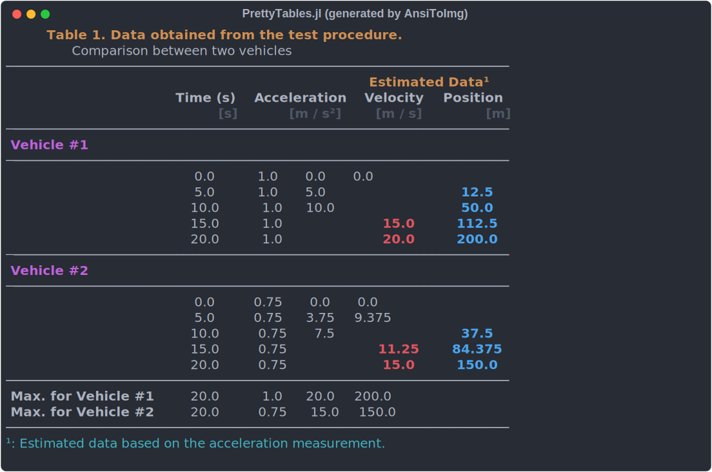

# PrettyTables.jl

[](https://github.com/ronisbr/PrettyTables.jl/actions)
[](https://codecov.io/gh/ronisbr/PrettyTables.jl)
[][docs-stable-url]
[][docs-dev-url]
[](https://github.com/invenia/BlueStyle)
[](https://zenodo.org/doi/10.5281/zenodo.10015722)

This package has the purpose to print data in matrices in a human-readable format. It was
inspired in the functionality provided by https://ozh.github.io/ascii-tables/

## Installation

```julia-repl
julia> using Pkg
julia> Pkg.add("PrettyTables")
```

## Example

```julia
julia> using PrettyTables

julia> t = 0:1:20
0:1:20

julia> data = hcat(t, ones(length(t) ), t, 0.5.*t.^2);

julia> header = (
           ["Time", "Acceleration", "Velocity", "Distance"],
           [   "s",     "[m / s²]",  "[m / s]",      "[m]"]
       )
(["Time", "Acceleration", "Velocity", "Distance"], ["s", "[m / s²]", "[m / s]", "[m]"])

julia> hl_p = Highlighter(
           (data, i, j) -> (j == 4) && (data[i, j] > 9),
           crayon"blue bold"
       );

julia> hl_v = Highlighter(
           (data, i, j) -> (j == 3) && (data[i, j] > 9),
           crayon"red bold"
       );

julia> hl_10 = Highlighter(
           (data, i, j) -> (i == 10),
           crayon"fg:white bold bg:dark_gray"
       );

julia> pretty_table(
    data;
    formatters    = ft_printf("%5.2f", 2:4),
    header        = header,
    header_crayon = crayon"yellow bold",
    highlighters  = (hl_10, hl_p, hl_v),
    tf            = tf_unicode_rounded
)
```



## Usage

See the [documentation][docs-stable-url].

[docs-dev-url]: https://ronisbr.github.io/PrettyTables.jl/dev
[docs-stable-url]: https://ronisbr.github.io/PrettyTables.jl/stable
