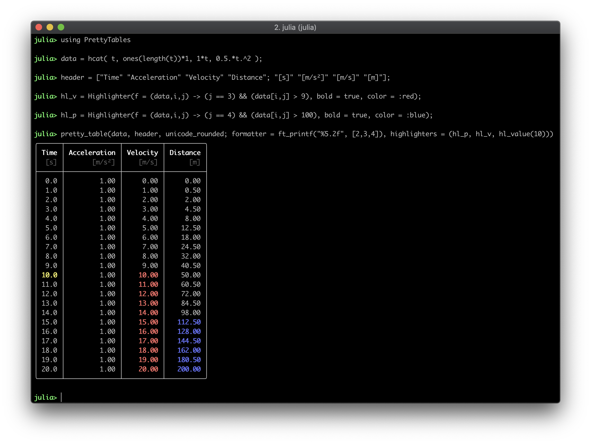

Pretty Tables
=============

[](https://github.com/ronisbr/PrettyTables.jl/actions)
[](https://codecov.io/gh/ronisbr/PrettyTables.jl)
[][docs-stable-url]
[][docs-dev-url]
[](https://github.com/invenia/BlueStyle)

This package has the purpose to print data in matrices in a human-readable
format. It was inspired in the functionality provided by
https://ozh.github.io/ascii-tables/

## Backends status

* **Text backend**: stable.
* **HTML backend**: not stable, API can change in minor versions, consider as
    **beta**.
* **LaTeX backend**: not stable, API can change in minor version, consider as
    **beta**.

## Installation

```julia-repl
julia> using Pkg
julia> Pkg.add("PrettyTables")
```

## Example



## Usage

See the [documentation][docs-stable-url].

[docs-dev-url]: https://ronisbr.github.io/PrettyTables.jl/dev
[docs-stable-url]: https://ronisbr.github.io/PrettyTables.jl/stable
