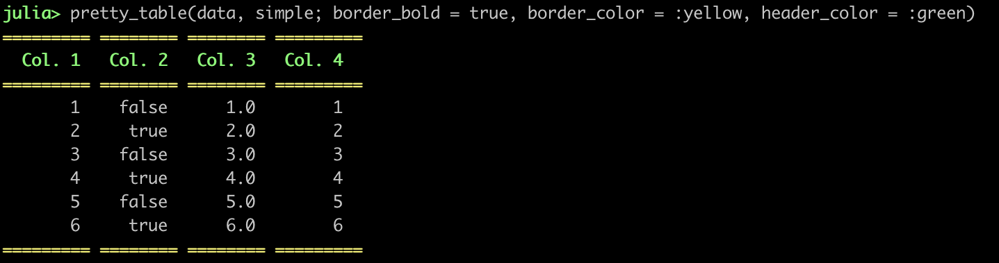
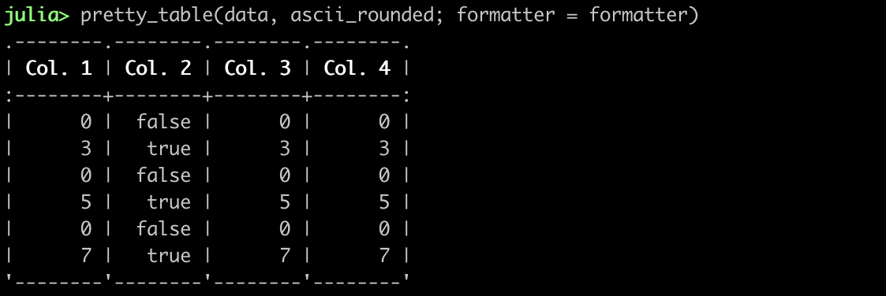

Pretty Tables
=============

[](https://travis-ci.org/ronisbr/PrettyTables.jl)
[](https://ci.appveyor.com/project/ronisbr/prettytables-jl)
[](https://codecov.io/gh/ronisbr/PrettyTables.jl)
[](https://coveralls.io/github/ronisbr/PrettyTables.jl?branch=master)

This package has the purpose to print data in matrices in a human-readable
format. It was inspired in the functionality provided by
https://ozh.github.io/ascii-tables/

## Requirements

* Julia >= 1.0
* Parameters >= 0.10.3

## Installation

```julia-repl
julia> using Pkg
julia> Pkg.add("PrettyTables")
```

## Usage

The following function can be used to print data stored inside a `Matrix{Any}`:

```julia
function pretty_table(data, format = unicode; ...)
```

in which `data` is the matrix that will be printed and `format` is the selected
format (see [Formats](#formats)). The following keywords are available to modify
the behavior:

* `alignment`: Select the alignment of the columns (see the section
               [Alignment](#alignment)).
* `border_bold`: If `true`, then the border will be printed in **bold**
                 (**Default** = `false`).
* `border_color`: The color in which the border will be printed using the same
                  convention as in the function `printstyled`. (**Default** =
                  `:normal`)
* `formatter`: See the section [Formatter](#formatter).
* `header_bold`: If `true`, then the header will be printed in **bold**
                 (**Default** = `false`).
* `header_color`: The color in which the header will be printed using the same
                  convention as in the function `printstyled`. (**Default** =
                  `:normal`)
* `highlighters`: A tuple with a list of highlighters (see the section
                  [Highlighters](#highlighters).
* `same_column_size`: If `true`, then all the columns will have the same size.
                      (**Default** = `false`)
* `show_row_number`: If `true`, then a new column will be printed showing the
                     row number. (**Default** = `false`.)

## Alignment

The keyword `alignment` can be a `Symbol` or a vector of `Symbol`.

If it is a symbol, we have the following behavior:

* `:l` or `:L`: the text of all columns will be left-aligned;
* `:c` or `:C`: the text of all columns will be center-aligned;
* `:r` or `:R`: the text of all columns will be right-aligned;
* Otherwise it defaults to `:r`.

If it is a vector, then it must have the same number of symbols as the number of
columns in `data`. The *i*-th symbol in the vector specify the alignment of the
*i*-th column using the same symbols as described previously.

## Formatter

The keyword `formatter` can be used to pass functions to format the values in
the columns. It must be a `Dict{Number,Function}()`. The key indicates the
column number in which its elements will be converted by the function in the
value of the dictionary. The function must have the following signature:

    f(value, i)

in which `value` is the data and `i` is the row number. It must return the
formatted value.

For example, if we want to multiply all values in odd rows of the column 2 by π,
then the formatter should look like:

    Dict(2 => (v,i)->isodd(i) ? v*π : v)

If the key `0` is present, then the corresponding function will be applied to
all columns that does not have a specific key.

## Highlighters

A set of highlighters can be passed as a `Tuple` to the `highlighter` keyword.
Each highlighter is an instance of the structure `Highlighter` that contains
three fields:

* `f`: Function with the signature `f(data,i,j)` in which should return `true`
       if the element `(i,j)` in `data` must be highlighted, or `false`
       otherwise.
* `bold`: If `true`, then the highlight style should be **bold**.
* `color`: A symbol with the color of the highlight style using the same
           convention as in the function `printstyled`.

The function `f` has the following signature:

    f(data, i, j)

in which `data` is a reference to the data that is being printed, `i` and `j`
are the element coordinates that are being tested. If this function returns
`true`, then the highlight style will be applied to the `(i,j)` element.
Otherwise, the default style will be used.

Notice that if multiple highlighters are valid for the element `(i,j)`, then the
applied style will be equal to the first match considering the order in the
Tuple `highlighters`.

## Formats

The following table formats are available:

`unicode` (**Default**)

```
┌────────┬────────┬────────┬────────┐
│ Col. 1 │ Col. 2 │ Col. 3 │ Col. 4 │
├────────┼────────┼────────┼────────┤
│      1 │  false │    1.0 │      1 │
│      2 │   true │    2.0 │      2 │
│      3 │  false │    3.0 │      3 │
└────────┴────────┴────────┴────────┘
```

`ascii_dots`

```
.....................................
: Col. 1 : Col. 2 : Col. 3 : Col. 4 :
:........:........:........:........:
:      1 :  false :    1.0 :      1 :
:      2 :   true :    2.0 :      2 :
:      3 :  false :    3.0 :      3 :
:........:........:........:........:
```

`ascii_rounded`

```
.--------.--------.--------.--------.
| Col. 1 | Col. 2 | Col. 3 | Col. 4 |
:--------+--------+--------+--------:
|      1 |  false |    1.0 |      1 |
|      2 |   true |    2.0 |      2 |
|      3 |  false |    3.0 |      3 |
'--------'--------'--------'--------'
```

`compact`

```
 -------- -------- -------- --------
  Col. 1   Col. 2   Col. 3   Col. 4
 -------- -------- -------- --------
       1    false      1.0        1
       2     true      2.0        2
       3    false      3.0        3
 -------- -------- -------- --------
```

`markdown`

```
| Col. 1 | Col. 2 | Col. 3 | Col. 4 |
|--------|--------|--------|--------|
|      1 |  false |    1.0 |      1 |
|      2 |   true |    2.0 |      2 |
|      3 |  false |    3.0 |      3 |
```

`mysql`

```
+--------+--------+--------+--------+
| Col. 1 | Col. 2 | Col. 3 | Col. 4 |
+--------+--------+--------+--------+
|      1 |  false |    1.0 |      1 |
|      2 |   true |    2.0 |      2 |
|      3 |  false |    3.0 |      3 |
+--------+--------+--------+--------+
```

`simple`

```
========= ======== ======== =========
  Col. 1   Col. 2   Col. 3   Col. 4
========= ======== ======== =========
       1    false      1.0        1
       2     true      2.0        2
       3    false      3.0        3
========= ======== ======== =========
```

## Example

In the following, it is presented how the following matrix can be printed using
this package:

```julia-repl
julia> data = ["Col. 1" "Col. 2" "Col. 3" "Col. 4";
                     1    false      1.0     0x01 ;
                     2     true      2.0     0x02 ;
                     3    false      3.0     0x03 ;
                     4     true      4.0     0x04 ;
                     5    false      5.0     0x05 ;
                     6     true      6.0     0x06 ;]
```







The following example indicates how `highlighters` can be used to highlight the
lowest and highest element in the data considering the columns 1, 3, and 5:


If you want to save the printed table to a file, you can do:

```julia-repl
julia> open("output.txt", "w") do f
       pretty_table(f,data)
       end
```

It is also possible to define you own custom table by creating a new instance of
the structure `PrettyTableFormat`. For example, let's say that you want a table
like `simple` that does not print the bottom line:

```julia-repl
julia> tf = PrettyTableFormat(simple, bottom_line = false);

julia> pretty_table(data, tf)
========= ======== ======== =========
  Col. 1   Col. 2   Col. 3   Col. 4
========= ======== ======== =========
       1    false      1.0        1
       2     true      2.0        2
       3    false      3.0        3
       4     true      4.0        4
       5    false      5.0        5
       6     true      6.0        6
```

For more information, see the documentation of the structure
`PrettyTableFormat`.
