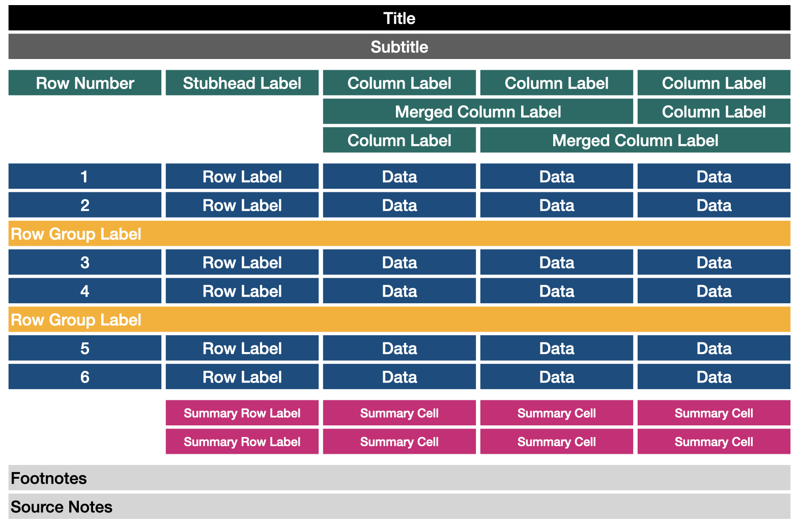

# PrettyTables.jl

```@meta
CurrentModule = PrettyTables
```

```@setup index
using PrettyTables
```

**PrettyTables.jl** prints data in formatted tables. It was originally inspired by the
functionality provided by [ASCII Tables](https://ozh.github.io/ascii-tables/).

The same table can be rendered by the following back ends:

| Back End | Keyword               | Output                                                       |
|:---------|:----------------------|:-------------------------------------------------------------|
| Text     | `backend = :text`     | Table for the terminal, decorated with ANSI escape sequences |
| HTML     | `backend = :html`     | HTML table, rendered by Jupyter, Pluto, and Documenter       |
| LaTeX    | `backend = :latex`    | `tabular` environment                                        |
| Markdown | `backend = :markdown` | Markdown table                                               |
| Typst    | `backend = :typst`    | Typst `table` function                                       |
| Excel    | `backend = :excel`    | Excel worksheet (requires XLSX.jl)                           |
| Word     | `backend = :docx`     | Word table (requires WriteDocx.jl)                           |

**PrettyTables.jl** allows printing the data together with some table sections, which can
be modified by the user to obtain the desired output. The sections currently available
are:



This design is heavily inspired by the R package [gt](https://github.com/rstudio/gt/), but
the API is quite different due to the differences between the R and Julia languages.

## Installation

```julia-repl
julia> using Pkg

julia> Pkg.add("PrettyTables")
```

## Example

The following example shows some of the features available in **PrettyTables.jl**. The
highlighters, the table format, and the table style are defined using the backend-agnostic
types [`Highlighter`](@ref), [`TableFormat`](@ref), and [`TableStyle`](@ref). Hence, the
same configuration can be used with every back end.

```@example index
# == Creating the Table ====================================================================

v1_t = 0:5:20
v1_a = ones(length(v1_t)) * 1.0
v1_v = @. 0 + v1_a * v1_t
v1_d = @. 0 + v1_a * v1_t^2 / 2

v2_t = 0:5:20
v2_a = ones(length(v2_t)) * 0.75
v2_v = @. 0 + v2_a * v2_t
v2_d = @. 0 + v2_a * v2_t^2 / 2

table = [
    v1_t v1_a v1_v v1_d
    v2_t v2_a v2_v v2_d
]

# == Configuring the Table =================================================================

title = "Table 1. Data obtained from the test procedure."

subtitle = "Comparison between two vehicles"

column_labels = [
    [EmptyCells(2), MultiColumn(2, "Estimated Data")],
    ["Time (s)", "Acceleration", "Velocity", "Position"],
    [
        styled"{(foreground=gray):[s]}",
        styled"{(foreground=gray):[m / s²]}",
        styled"{(foreground=gray):[m / s]}",
        styled"{(foreground=gray):[m]}",
    ],
]

row_group_labels = [
    1 => "Vehicle #1",
    6 => "Vehicle #2"
]

summary_rows = [
    (data, j) -> maximum(@views data[ 1:5, j]),
    (data, j) -> maximum(@views data[6:10, j]),
]

summary_row_labels = [
    "Max. for Vehicle #1",
    "Max. for Vehicle #2",
]

footnotes = [
    (:column_label, 1, 3) => "Estimated data based on the acceleration measurement."
]

highlighters = [
    Highlighter(
        (data, i, j) -> (j == 3) && (data[i, j] > 10),
        Face(; weight = :bold, foreground = :red)
    ),
    Highlighter(
        (data, i, j) -> (j == 4) && (data[i, j] > 10),
        Face(; weight = :bold, foreground = :blue)
    ),
]

table_format = TableFormat(; @no_vertical_lines)

style = TableStyle(;
    column_label                   = Face(; weight = :bold),
    first_line_merged_column_label = Face(;
        weight = :bold, foreground = :yellow, underline = true
    ),
    footnote                       = Face(; foreground = :cyan),
    row_group_label                = Face(; weight = :bold, foreground = :magenta),
    subtitle                       = Face(; slant = :italic),
    title                          = Face(; weight = :bold, foreground = :yellow),
)

nothing # hide
```

```julia-repl
julia> pretty_table(
    table;
    column_labels,
    footnotes,
    highlighters,
    row_group_labels,
    style,
    subtitle,
    summary_row_labels,
    summary_rows,
    table_format,
    title,
)
```

```@setup index
str = pretty_table(
    String,
    table;
    color = true,
    column_labels,
    footnotes,
    highlighters,
    row_group_labels,
    style,
    subtitle,
    summary_row_labels,
    summary_rows,
    table_format,
    title,
)

write("tmp", str)

run(`ansitoimg --width 70 --title "PrettyTables.jl (generated by AnsiToImg)" tmp welcome_figure.svg`)

run(`rm tmp`)
```


Passing `backend = :html` to the same call renders the table in HTML:

```@example index
pretty_table(
    HTML,
    table;
    column_labels,
    footnotes,
    highlighters,
    row_group_labels,
    style,
    subtitle,
    summary_row_labels,
    summary_rows,
    table_format,
    title,
)
```

## Where to Go Next

- [Quick Start](man/quick_start.md): the essential commands to print a table.
- [Usage](man/usage.md): the keywords available in every back end and the specification of
  the table sections, formatters, and highlighters.
- [Faces](man/faces.md): how the decorations are described using the faces of
  StyledStrings.jl.
- [Table Format and Style](man/table_format.md): how to configure the table lines and the
  decoration of each section once for every back end.
- The pages in **Back Ends**: the options specific to each back end and some examples.
