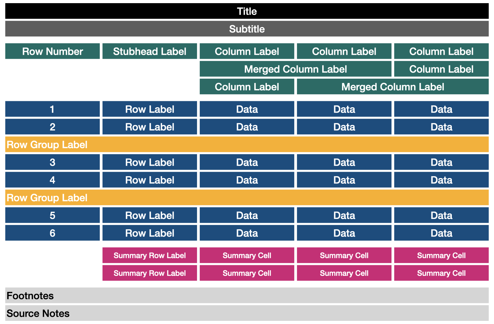

# PrettyTables.jl

```@meta
CurrentModule = PrettyTables
```

```@setup index
using PrettyTables
```

This package has the purpose to print data in matrices using different backends. It was
orizinally inspired in the functionality provided by
[ASCII Tables](https://ozh.github.io/ascii-tables/).

**PrettyTables.jl** allows to print the data together with some table sections. They can be
modified by the user to obtain the desired output. The sections currently available are:



This design is heavily inspired by the R's package [gt](https://github.com/rstudio/gt/) but
the API is highly different due to the differences between the R and Julia languages.

```@repl index
using PrettyTables

t = 0:1:20

data = hcat(t, ones(length(t) ), t, 0.5.*t.^2);

column_labels = [
    ["Time", "Acceleration", "Velocity", "Distance"],
    [ "[s]",     "[m / s²]",  "[m / s]",      "[m]"]
]

hl_p = TextHighlighter(
    (data, i, j) -> (j == 4) && (data[i, j] > 9),
    crayon"blue bold"
);

hl_v = TextHighlighter(
    (data, i, j) -> (j == 3) && (data[i, j] > 9),
    crayon"red bold"
);

hl_10 = TextHighlighter(
    (data, i, j) -> (i == 10),
    crayon"fg:white bold bg:dark_gray"
);

style = TextTableStyle(first_line_column_label = crayon"yellow bold");

table_format = TextTableFormat(borders = text_table_borders__unicode_rounded);
```

```julia-repl
julia> pretty_table(
    data;
    column_labels = column_labels,
    style         = style,
    highlighters  = [hl_10, hl_p, hl_v],
    table_format  = table_format_format  = TextTableFormat(borders = text_table_borders__unicode_rounded)
)
```

```@setup index
str = pretty_table(
    String,
    data;
    color         = true,
    column_labels = column_labels,
    style         = style,
    highlighters  = [hl_10, hl_p, hl_v],
    table_format  = table_format
)

write("tmp", str)

run(`ansitoimg --width 60 --title "PrettyTables.jl (generated by AnsiToImg)" tmp welcome_figure.svg`)

run(`rm tmp`)
```


## Installation

```julia-repl
julia> using Pkg
julia> Pkg.add("PrettyTables")
```

<!--## Manual outline-->
<!---->
<!--```@contents-->
<!--Pages = [-->
<!--    "man/usage.md"-->
<!--    "man/text_backend.md"-->
<!--    "man/html_backend.md"-->
<!--    "man/latex_backend.md"-->
<!--    "man/markdown_backend.md"-->
<!--    "man/alignment.md"-->
<!--    "man/formatters.md"-->
<!--    "man/text_examples.md"-->
<!--    "man/html_examples.md"-->
<!--    "lib/library.md"-->
<!--]-->
<!--Depth = 2-->
<!--```-->
