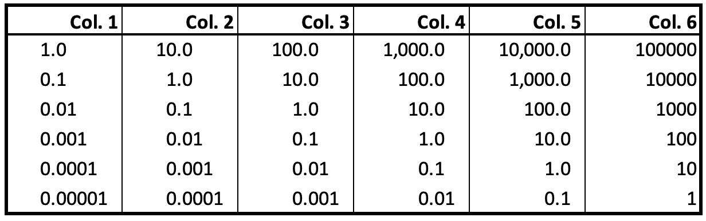
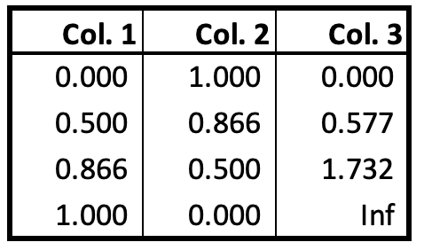
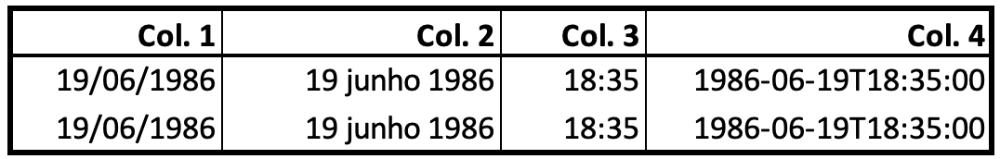
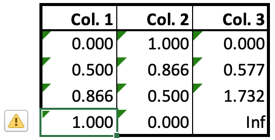
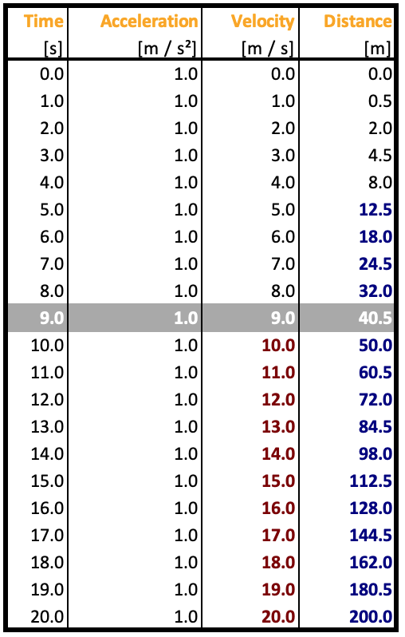
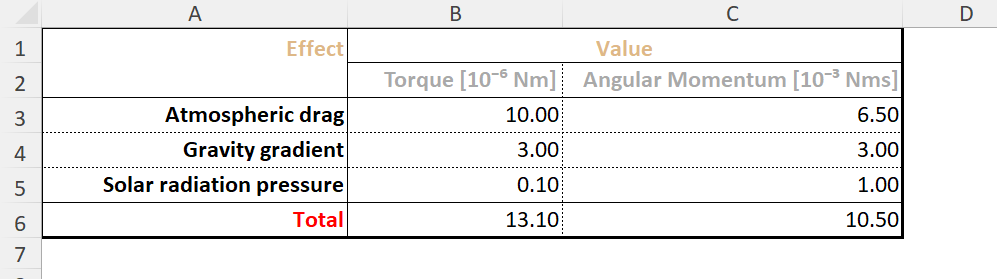
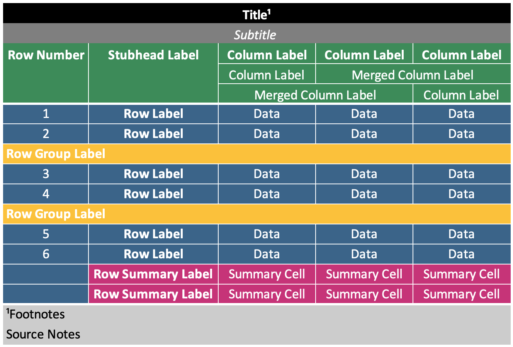
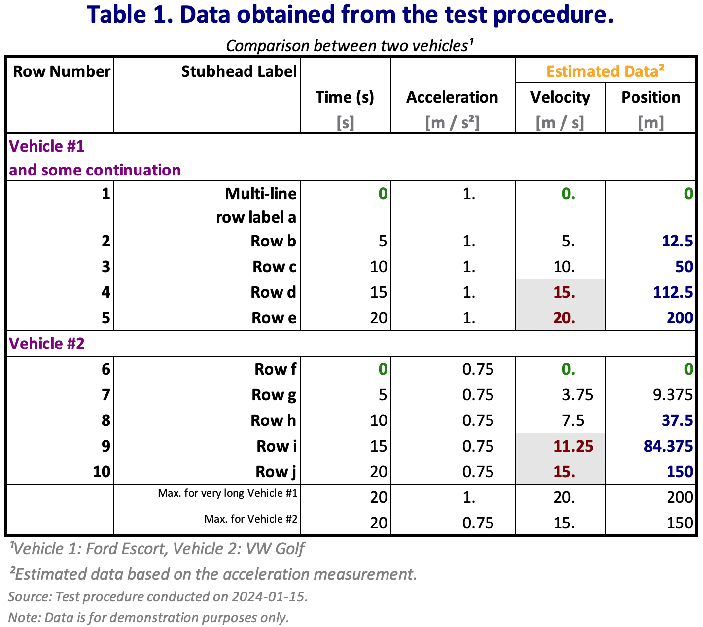

# Excel Backend Examples

Here we show some examples produced by the Excel backend.

## Excel Formatter

Native Excel formatting can straightforwardly be used to format the display format of table
data without affecting the underlying values.

```julia
data = [10.0^(-i + j) for i in 1:6, j in 1:6];

f1 = ExcelFormatter((data, i, j) -> j==1, ["format" => "#,##0.0????_0"]);
f2 = ExcelFormatter((data, i, j) -> j==2, ["format" => "#,##0.0???_0"]);
f3 = ExcelFormatter((data, i, j) -> j==3, ["format" => "#,##0.0??_0"]);
f4 = ExcelFormatter((data, i, j) -> j==4, ["format" => "#,##0.0?_0"]);
f5 = ExcelFormatter((data, i, j) -> j==5, ["format" => "#,##0.0_0"]);
f6 = ExcelFormatter((data, i, j) -> j==6, ["format" => "#,##0_0"]);

f = pretty_table(
    data;
    anchor_cell = "B2",
    backend = :excel,
    data_column_widths = 10.5,
    excel_formatters = [f1, f2, f3, f4, f5, f6],
)

writexlsx("output.xlsx", f; overwrite = true);
```



```julia
data = [f(a) for a = 0:30:90, f in (sind, cosd, tand)];

f = pretty_table(
    data;
    anchor_cell = "B2",
    backend = :excel,
    excel_formatters = [ExcelFormatter((v, i, j) -> true, ["format" => "0.000_);;@_)"])],
)

writexlsx("output.xlsx", f; overwrite = true);
```



The calculated values of the trigonometric functions are written natively to Excel at full
precision but the `ExcelFormatter` sets the Excel display format to only show three decimal
places in the table.

When an Excel formatter is used, the printed width of cell data is determined by Excel based
on the format specified. It cannot be known by PrettyTables.jl. For this reason, most cell
data values are not considered by the automatic determination of column widths, which
therefore relies on the column headers only. However, if cells contain text (or are
otherwise represnted as `Strings`), these are included in column width determination (text
is less likely to be significantly impacted by Excel formatting - although this is not
impossible).

If automatic determination of column widths is unsatisfactory, consider setting minimum
and/or maximum width limits or fixing column widths entirely.

To illustrate the extent to which formatting affects width even of the same data, consider:

```julia
dt = Dates.DateTime("1986-06-19T18:35:00");

matrix = [
    dt dt dt dt
    dt dt dt dt
];

f = pretty_table(
    XLSX.XLSXFile,
    matrix;
    anchor_cell = "B2",
    data_column_widths = [12.0, 16.0, 8.0, 20.0],
    excel_formatters = [
        ExcelFormatter((v, i, j) -> (j == 1), ["format" => "ShortDate"])
        ExcelFormatter((v, i, j) -> (j == 2), ["format" => "d mmmm yyyy"])
        ExcelFormatter((v, i, j) -> (j == 3), ["format" => "hh:mm"])
        ExcelFormatter((v, i, j) -> (j == 4), ["format" => "yyyy-mm-dd\"T\"hh:mm:ss"])
    ],
)

XLSX.writexlsx("output.xlsx", f; overwrite = true);
```



## Predefined Formatters

Predefined formatters are intended for text output. They can be used straightforwardly with
the `:excel` backend but convert cell data to formatted strings rather than passing the
native values.

For example, using the same trigonometry data table as above:

```julia
data = [f(a) for a = 0:30:90, f in (sind, cosd, tand)];

f = pretty_table(
    data;
    anchor_cell = "B2",
    backend = :excel,
    formatters = [fmt__printf("%5.3f")],
    filename = "output.xlsx",
    overwrite = true
)
```



Excel generates a warning that numbers are represented as text. Clicking in such a cell and
hitting enter causes Excel to convert the string to a number again, but the formatting is
lost (eg, `1.000` => `1`). Moreover, by converting to a string, the precision has been
truncated to the length of the string. While not important for presentation purposes, if the
table is used in Excel as input for further calculation, some information will have been
lost.

Numbers passed via a predefined formatter are converted to a string representation and so
will always be included in the column width determination.

An Excel formatter and a predefined formatter can readily be applied to the same cell, if
useful. For example, the addition of

```julia
excel_formatters = [ExcelFormatter((v, i, j) -> true, ["format" => "@_0"])],
```

in the above `pretty_table` specification would provide a right cell margin the width of one
'`0`' character to the data in each cell, similar to the one included in the first example.

## Excel Highlighters

```julia
t = 0:1:20;

data = hcat(t, ones(length(t) ), t, 0.5.*t.^2);

column_labels = [
    ["Time", "Acceleration", "Velocity", "Distance"],
    [ "[s]",     "[m / s²]",  "[m / s]",      "[m]"]
];

hl_p = ExcelHighlighter(
    (data, i, j) -> (j == 4) && (data[i, j] > 9),
    ["color" => "navy", "bold" => "true"]
);

hl_v = ExcelHighlighter(
    (data, i, j) -> (j == 3) && (data[i, j] > 9),
    ["color" => "maroon", "bold" => "true"]
);

 hl_10 = ExcelHighlighter(
     (data, i, j) -> (i == 10),
     [
         "color" => "white",
         "bold" => "true",
         "cell_fill_fgColor" => "darkgray",
         "cell_fill_pattern" => "solid",
     ]
 );

style = ExcelTableStyle(first_line_column_label = ["color" => "orange", "bold" => "true"]);

f = pretty_table(
    data;
    anchor_cell = "B2",
    backend = :excel,
    column_labels = column_labels,
    excel_formatters = [ExcelFormatter((v, i, j) -> true, ["format" => "#,##0.0"])],
    highlighters = [hl_10, hl_p, hl_v],
    style = style,
)

XLSX.writexlsx("output.xlsx", f; overwrite=true);
```



## Excel Table Style

```julia
data = [
    10.0 6.5
     3.0 3.0
     0.1 1.0
];

row_labels = [
   "Atmospheric drag"
   "Gravity gradient"
   "Solar radiation pressure"
]
column_labels = [
    [MultiColumn(2, "Value", :c)],
    [
        "Torque [10⁻⁶ Nm]",
        "Angular Momentum [10⁻³ Nms]"
    ]
]

pretty_table(
    data;
    anchor_cell = "B2",
    backend = :excel,
    column_labels,
    excel_formatters = [ExcelFormatter((v, i, j) -> true, ["format" => "Number"])],
    filename = "output.xlsx",
    merge_column_label_cells = :auto,
    overwrite = true,
    row_labels,
    stubhead_label = "Effect",
    style = ExcelTableStyle(;
        first_line_merged_column_label = ["color" => "navy", "bold" => "true"],
        column_label                   = ["color" => "grey"],
        stubhead_label                 = ["color" => "navy", "bold" => "true"],
        summary_row_label              = ["color" => "orange", "bold" => "true"]
    ),
    summary_row_labels = ["Total"],
    summary_rows = [(data, i) -> sum(data[:, i])],
)
```



## Excel borders and fill

```julia
matrix = [
    "Data" "Data" "Data"
    "Data" "Data" "Data"
    "Data" "Data" "Data"
    "Data" "Data" "Data"
    "Data" "Data" "Data"
    "Data" "Data" "Data"
]

f = pretty_table(
    XLSX.XLSXFile,
    matrix;
    anchor_cell = "B2",
    alignment = :c,
    column_labels = [
        ["Column Label", "Column Label", "Column Label"],
        ["Column Label", MultiColumn(2, "Merged Column Label")],
        [MultiColumn(2, "Merged Column Label"), "Column Label"],
    ],
    footnotes = [(:title, 1, 1) => "Footnotes"],
    merge_column_label_cells = :auto,
    row_group_labels = [3 => "Row Group Label", 5 => "Row Group Label"],
    row_label_column_alignment = :c,
    row_labels = fill("Row Label", 6),
    row_number_column_alignment = :c,
    row_number_column_label = "Row Number",
    show_row_number_column = true,
    source_notes = "Source Notes",
    style = ExcelTableStyle(;
        title = [
          "color" => "white",
          "bold" => "true",
          "cell_fill_pattern" => "solid",
          "cell_fill_fgColor" => "black"
        ],
        subtitle = [
          "color" => "white",
          "italic" => "true",
          "cell_fill_pattern" => "solid",
          "cell_fill_fgColor" => "grey50"
        ],
        row_number_label = [
          "color" => "white",
          "bold" => "true",
          "cell_fill_pattern" => "solid",
          "cell_fill_fgColor" => "seagreen"
        ],
        row_number = [
          "color" => "white",
          "cell_fill_pattern" => "solid",
          "cell_fill_fgColor" => "steelblue4"
        ],
        stubhead_label = [
          "color" => "white",
          "bold" => "true",
          "cell_fill_pattern" => "solid",
          "cell_fill_fgColor" => "seagreen"
        ],
        row_label = [
          "color" => "white",
          "bold" => "true",
          "cell_fill_pattern" => "solid",
          "cell_fill_fgColor" => "steelblue4"
        ],
        first_line_column_label = [
          "color" => "white",
          "bold" => "true",
          "cell_fill_pattern" => "solid",
          "cell_fill_fgColor" => "seagreen"
        ],
        column_label = [
          "color" => "white",
          "cell_fill_pattern" => "solid",
          "cell_fill_fgColor" => "seagreen"
        ],
        first_line_merged_column_label = [
          "color" => "white",
          "bold" => "true"
        ],
        merged_column_label = [
          "color" => "white",
          "cell_fill_pattern" => "solid",
          "cell_fill_fgColor" => "seagreen"
        ],
        row_group_label = [
          "color" => "white",
          "bold" => "true",
          "cell_fill_pattern" => "solid",
          "cell_fill_fgColor" => "goldenrod1"
        ],
        data_cell = [
          "color" => "white",
          "cell_fill_pattern" => "solid",
          "cell_fill_fgColor" => "steelblue4"
        ],
        summary_row_label = [
          "color" => "white",
          "bold" => "true",
          "cell_fill_pattern" => "solid",
          "cell_fill_fgColor" => "violetred3"
        ],
        summary_row_cell = [
          "cell_fill_pattern" => "solid",
          "cell_fill_fgColor" => "violetred3",
          "color" => "white"
        ],
        footnote = [
          "cell_fill_pattern" => "solid",
          "cell_fill_fgColor" => "grey80"
        ],
        source_note = [
          "color" => "black",
          "cell_fill_pattern" => "solid",
          "cell_fill_fgColor" => "grey80"
        ],
    ),
    stubhead_label  = "Stubhead Label",
    subtitle = "Subtitle",
    summary_row_labels = ["Row Summary Label", "Row Summary Label"],
    summary_rows = [(data, i) -> "Summary Cell", (data, i) -> "Summary Cell"],
    table_format = ExcelTableFormat(;
        @excel__all_horizontal_lines,
        @excel__all_vertical_lines,
        horizontal_line_at_beginning     = false,
        vertical_line_at_beginning       = false,
        vertical_line_after_data_columns = false,
        borders = ExcelTableBorders(
            header_line             = ["style" => "thick", "color" => "white"],
            merged_header_cell_line = ["style" => "thin",  "color" => "white"],
            middle_line             = ["style" => "thin",  "color" => "white"],
            bottom_line             = ["style" => "thick", "color" => "white"],
            center_line             = ["style" => "thin",  "color" => "white"],
        ),
    ),
    title = "Title",
)

XLSX.writexlsx("output.xlsx", f; overwrite = true)
```




## Putting it all together

```julia
# == Creating the Table ====================================================================

v1_t = 0:5:20;

v1_a = ones(length(v1_t)) * 1.0;

v1_v = @. 0 + v1_a * v1_t;

v1_d = @. 0 + v1_a * v1_t^2 / 2;

v2_t = 0:5:20;

v2_a = ones(length(v2_t)) * 0.75;

v2_v = @. 0 + v2_a * v2_t;

v2_d = @. 0 + v2_a * v2_t^2 / 2;

table = [
  v1_t v1_a v1_v v1_d
  v2_t v2_a v2_v v2_d
];

# == Configuring the Table =================================================================

title = "Table 1. Data obtained from the test procedure.";

subtitle = "Comparison between two vehicles";

column_labels = [
    [EmptyCells(2), MultiColumn(2, "Estimated Data")],
    ["Time (s)", "Acceleration", "Velocity", "Position"],
];

units = [
  styled"{(foreground=gray):[s]}",
  styled"{(foreground=gray):[m / s²]}",
  styled"{(foreground=gray):[m / s]}",
  styled"{(foreground=gray):[m]}",
];

push!(column_labels, units);

merge_column_label_cells = :auto;

column_label_alignment = :c;

show_row_number_column = true;
row_number_column_label = "Row Number";

stubhead_label="Stubhead Label";

row_labels = [
    "Multi-line\nrow label a",
    "Row b",
    "Row c",
    "Row d",
    "Row e",
    "Row f",
    "Row g",
    "Row h",
    "Row i",
    "Row j"
]

row_group_labels = [
    1 => "Vehicle #1\nand some continuation",
    6 => "Vehicle #2"
]

cell_alignment = [(data, i, j) -> :r]

summary_rows = [
    (data, j) -> maximum(@views data[ 1:5, j]),
    (data, j) -> maximum(@views data[6:10, j]),
]

summary_row_labels = [
    "Max. for very long Vehicle #1",
    "Max. for Vehicle #2",
]

footnotes = [
    (:subtitle, 1, 1) => "Vehicle 1: Ford Escort, Vehicle 2: VW Golf"
    (:column_label, 1, 3) => "Estimated data based on the acceleration measurement."
]

source_notes = "Source: Test procedure conducted on 2024-01-15.\nNote: Data is for demonstration purposes only."

excel_formatters = [
    ExcelFormatter((v, i, j) -> (j==1), ["format" => "#,##0_0_0"])
    ExcelFormatter((v, i, j) -> (j==2), ["format" => "#,##0.??_0_0"])
    ExcelFormatter((v, i, j) -> (j==3), ["format" => "#,##0.???"])
    ExcelFormatter((v, i, j) -> (j==4), ["format" => "0_0_0_0"])
]

highlighters = [
    ExcelHighlighter(
        (data, i, j) -> (j == 3) && (data[i, j] > 10),
        [
            "color" => "maroon",
            "bold" => "true",
            "cell_fill_pattern" => "solid",
            "cell_fill_fgColor" => "grey90"
        ],
    ),
    ExcelHighlighter(
        (data, i, j) -> (data[i, j] ≈ 0.0),
        ["color" => "green", "bold" => "true"],
    ),
    ExcelHighlighter(
        (data, i, j) -> (j == 4) && (data[i, j] > 10),
        [ "color" => "navy", "bold" => "true"]
    )
]

table_format = ExcelTableFormat(
    borders = ExcelTableBorders(
        top_line    = ["style" => "thick"],
        bottom_line = ["style" => "thick"],
        left_line   = ["style" => "thick"],
        right_line  = ["style" => "thick"],
    ),
)

style = ExcelTableStyle(
    column_label                   = ["bold" => "true"],
    summary_row_label              = ["size" => "8"],
    first_line_merged_column_label = ["bold" => "true", "color" => "orange"],
    footnote                       = ["italic" => "true", "color" => "gray"],
    row_group_label                = ["bold" => "true", "color" => "purple"],
    subtitle                       = ["italic" => "true"],
    title                          = ["bold" => "true", "color" => "navy", "size" => "18"],
)

# == Printing the Table ====================================================================

pretty_table(
    table;
    anchor_cell = "B2",
    backend = :excel,
    cell_alignment,
    column_label_alignment,
    column_labels,
    excel_formatters,
    filename = "output.xlsx",
    footnotes,
    highlighters,
    merge_column_label_cells,
    overwrite = true,
    row_group_labels,
    row_labels,
    row_number_column_label,
    show_row_number_column,
    source_notes,
    stubhead_label,
    style,
    subtitle,
    summary_row_labels,
    summary_rows,
    table_format,
    title,
)
```


