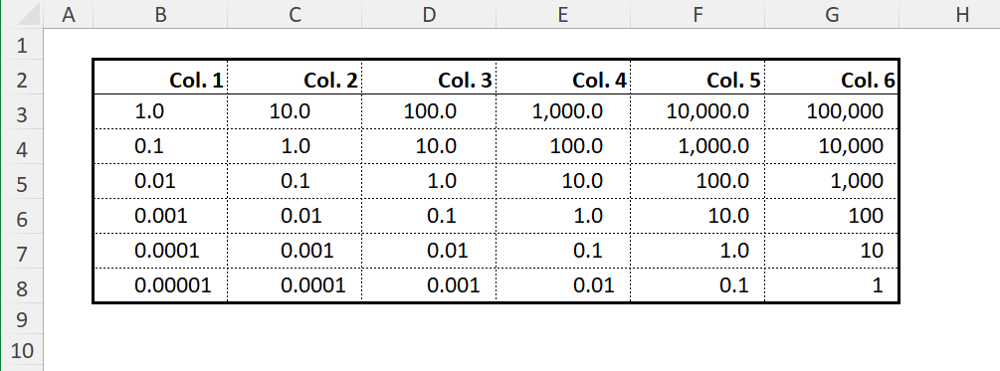
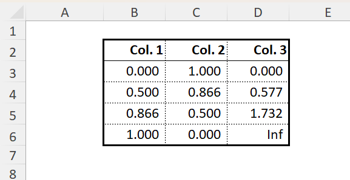
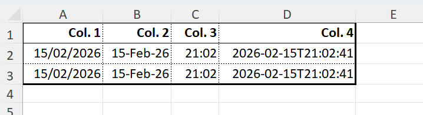
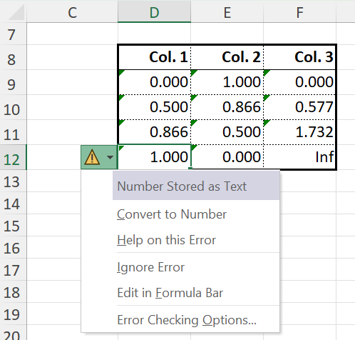
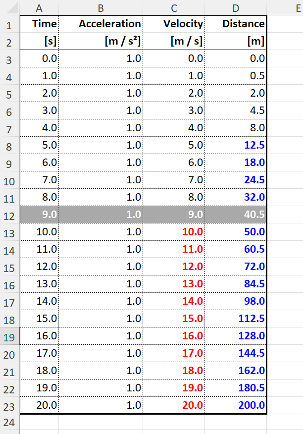
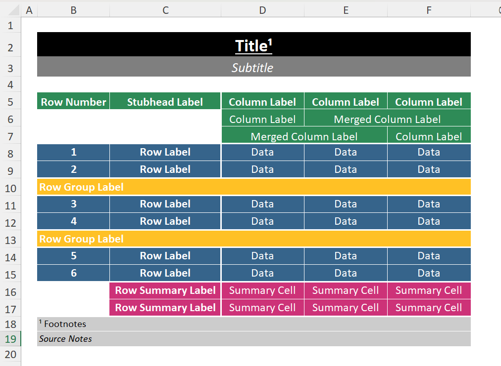
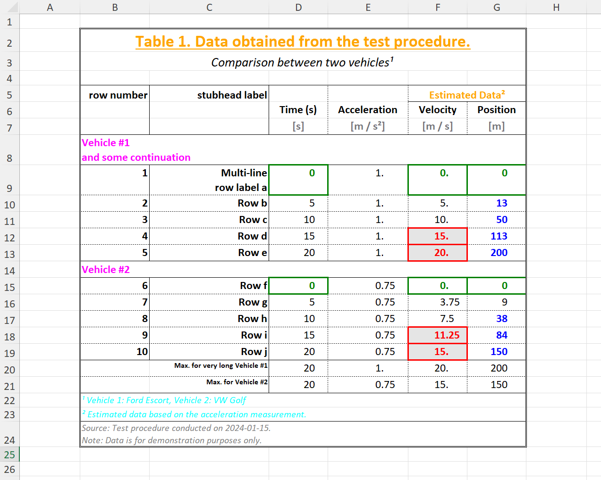

# Excel Backend Examples

Here we show some examples produced by the Excel backend.

## Excel Formatter

Native Excel formatting can straightforwardly be used to format the display format of 
table data without affecting the underlying values.

```julia
data = [10.0^(-i + j) for i in 1:6, j in 1:6]

f1 = ExcelFormatter((data, i, j) -> j==1, ["format" => "#,##0.0????_0"])

f2 = ExcelFormatter((data, i, j) -> j==2, ["format" => "#,##0.0???_0"])

f3 = ExcelFormatter((data, i, j) -> j==3, ["format" => "#,##0.0??_0"])

f4 = ExcelFormatter((data, i, j) -> j==4, ["format" => "#,##0.0?_0"])

f5 = ExcelFormatter((data, i, j) -> j==5, ["format" => "#,##0.0_0"])

f6 = ExcelFormatter((data, i, j) -> j==6, ["format" => "#,##0_0"])

f = pretty_table(
        data, 
        anchor_cell = "B2"; 
        table_format = ExcelTableFormat(data_column_width = 10.5), 
        excel_formatters = [f1, f2, f3, f4, f5, f6], 
        backend = :excel,
    )

```




```julia
julia> data = [f(a) for a = 0:30:90, f in (sind, cosd, tand)]
4×3 Matrix{Float64}:
 0.0       1.0        0.0
 0.5       0.866025   0.57735
 0.866025  0.5        1.73205
 1.0       0.0       Inf

julia> f = pretty_table(data; 
    excel_formatters = [ExcelFormatter((v, i, j) -> true, ["format" => "0.000_);;@_)"])], 
    backend = :excel, 
    anchor_cell = "B2"
)
XLSXFile("blank.xlsx") containing 1 Worksheet
            sheetname size          range
-------------------------------------------------
          prettytable 6x4           A1:D6

julia> writexlsx("mytest.xlsx", f, overwrite=true)
"C:\\Users\\...\\mytest.xlsx"
```


The calculated values of the trigonometric functions are written natively to Excel at full 
precision but the `ExcelFormatter` sets the Excel display format to only show three decimal 
places in the table.

When an Excel formatter is used, the printed width of cell data is determined by Excel based 
on the format specified. It cannot be known by PrettyTables. For this reason, most cell data 
values are not considered by the automatic determination of column widths, which therefore 
relies on the column headers only. However, if cells contain text (or are otherwise represnted 
as `Strings`), these are included in column width determination (text is less likely to be 
significantly impacted by Excel formatting - although this is not impossible).

If automatic determination of column widths is unsatisfactory, consider setting min and/or 
max width limits or fixing column widths entirely.

To illustrate the extent to which formatting affects width even of the same data, consider:

```julia
now = Dates.now()
matrix = [
    now now now now 
    now now now now 
]

result = pretty_table(
    XLSX.XLSXFile,
    matrix;
    excel_formatters = [
        ExcelFormatter((v, i, j) -> (j==1), ["format" => "ShortDate"])
        ExcelFormatter((v, i, j) -> (j==2), ["format" => "d mmmm yyyy"])
        ExcelFormatter((v, i, j) -> (j==3), ["format" => "hh:mm"])
        ExcelFormatter((v, i, j) -> (j==4), ["format" => "yyyy-mm-dd\"T\"hh:mm:ss"])
    ],
    table_format = ExcelTableFormat(data_column_width = [12.0, 16.0, 8.0, 20.0])
)
```



## Predefined Formatters

Predefined formatters are intended for text output. They can be used straightforwardly with 
the `:excel` backend but convert cell data to formatted strings rather than passing the 
native values.

For example, using the same trig data table as above:

```julia
pretty_table(data; 
    formatters = [fmt__printf("%5.3f")], 
    backend = :excel, 
    filename = "prettytable.xlsx", 
    overwrite = true, 
    anchor_cell = "D8"
)
```


Excel generates a warning that numbers are represented as text. Clicking in such a cell and 
hitting enter causes Excel to convert the string to a number again, but the formatting is 
lost (eg, `1.000` => `1`). Moreover, by converting to a string, the precision has been truncated 
to the length of the string. While not important for presentation purposes, if the table is 
used in Excel as input for further calculation, some information will have been lost.

Numbers passed via a predefined formatter are converted to a string representation and so 
will always be included in the column width determination.

An Excel formatter and a predefined formatter can readily be applied to the same cell, if 
useful. For example, the addition of

```julia
excel_formatters = [ExcelFormatter((v, i, j) -> true, ["format" => "@_0"])],
```
in the above `pretty_table` specification would provide a right cell margin the width of 
one '`0`' character to the data in each cell, similar to the one included in the first example.

## Excel Highlighters

```julia
julia>  t = 0:1:20
0:1:20

julia>  data = hcat(t, ones(length(t) ), t, 0.5.*t.^2);

julia>  column_labels = [
            ["Time", "Acceleration", "Velocity", "Distance"],
            [ "[s]",     "[m / s²]",  "[m / s]",      "[m]"]
        ]
2-element Vector{Vector{String}}:
 ["Time", "Acceleration", "Velocity", "Distance"]
 ["[s]", "[m / s²]", "[m / s]", "[m]"]

julia>  hl_p = ExcelHighlighter(
            (data, i, j) -> (j == 4) && (data[i, j] > 9),
            ["color" => "blue", "bold" => "true"]
        );

julia>  hl_v = ExcelHighlighter(
            (data, i, j) -> (j == 3) && (data[i, j] > 9),
            ["color" => "red", "bold" => "true"]
        );

julia>  hl_10 = ExcelHighlighter(
            (data, i, j) -> (i == 10),
            [:fill => ["pattern" => "solid", "fgColor" => "darkgray" ],
            :font => [ "color" => "white", "bold" => "true" ]]
        );

julia> style = ExcelTableStyle(first_line_column_label = ["color" => "yellow", "bold" => "true"]);

julia> f = pretty_table(
           data;
           column_labels = column_labels,
           excel_formatters = [ExcelFormatter((v, i, j) -> true, ["format" => "#,##0.0"])],
           style         = style,
           highlighters  = [hl_10, hl_p, hl_v],
           backend = :excel
       )
XLSXFile("blank.xlsx") containing 1 Worksheet
            sheetname size          range
-------------------------------------------------
          prettytable 23x4          A1:D23

julia> writexlsx("mytest.xlsx", f, overwrite=true)
"C:\\Users\\...\\mytest.xlsx"

```


## Excel Table Style

```julia
julia> data = [
           10.0 6.5
            3.0 3.0
            0.1 1.0
       ]
3×2 Matrix{Float64}:
 10.0  6.5
  3.0  3.0
  0.1  1.0

julia>  row_labels = [
            "Atmospheric drag"
            "Gravity gradient"
            "Solar radiation pressure"
        ]
3-element Vector{String}:
 "Atmospheric drag"
 "Gravity gradient"
 "Solar radiation pressure"

julia>  column_labels = [
            [MultiColumn(2, "Value", :c)],
            [
                "Torque [10⁻⁶ Nm]",
                "Angular Momentum [10⁻³ Nms]"
            ]
        ]
2-element Vector{Vector}:
 MultiColumn[MultiColumn(2, "Value", :c)]
 ["Torque [10⁻⁶ Nm]", "Angular Momentum [10⁻³ Nms]"]

julia>  f=pretty_table(
            data;
            backend = :excel,
            column_labels,
            merge_column_label_cells = :auto,
            row_labels,
            stubhead_label = "Effect",
            excel_formatters = [ExcelFormatter((v, i, j) -> true, ["format" => "Number"])],
            style = ExcelTableStyle(;
                first_line_merged_column_label = ["color" => "BurlyWood", "bold" => "true"],
                column_label                   = ["color" => "DarkGrey"],
                stubhead_label                 = ["color" => "BurlyWood", "bold" => "true"],
                summary_row_label              = ["color" => "red",       "bold" => "true"]
            ),
            summary_row_labels = ["Total"],
            summary_rows = [(data, i) -> sum(data[:, i])],
        )

XLSXFile("blank.xlsx") containing 1 Worksheet
            sheetname size          range
-------------------------------------------------
          prettytable 6x3           A1:C6


julia> writexlsx("mytest.xlsx", f, overwrite=true)
"C:\\Users\\...\\mytest.xlsx"

```


## Excel borders and fill

```julia
matrix = [
    "Data" "Data" "Data"
    "Data" "Data" "Data"
    "Data" "Data" "Data"
    "Data" "Data" "Data"
    "Data" "Data" "Data"
    "Data" "Data" "Data"
]

result = pretty_table(
    XLSX.XLSXFile,
    matrix,
    anchor_cell = "B2";
    title = "Title",
    subtitle = "Subtitle",
    stubhead_label  = "Stubhead Label",
    column_labels = [
        ["Column Label", "Column Label", "Column Label"],
        ["Column Label", MultiColumn(2, "Merged Column Label")],
        [MultiColumn(2, "Merged Column Label"), "Column Label"],
    ],
    merge_column_label_cells = :auto,
    show_row_number_column = true,
    row_number_column_label = "Row Number",
    row_labels = fill("Row Label", 6),
    row_group_labels = [3 => "Row Group Label", 5 => "Row Group Label"],
    summary_row_labels = ["Row Summary Label", "Row Summary Label"],
    summary_rows = [(data, i) -> "Summary Cell", (data, i) -> "Summary Cell"],
    footnotes = [
        (:title, 1, 1) => "Footnotes"
    ],
    source_notes = "Source Notes",
    alignment = :c,
    row_label_column_alignment = :c,
    row_number_column_alignment = :c,
    table_format = ExcelTableFormat(
        outside_border = false,
        underline_title_type = ["style" => "thick", "color" => "white"],
        underline_headers_type = ["style" => "thick", "color" => "white"],
        underline_between_headers_type = ["style" => "thin", "color" => "white"],
        underline_merged_headers_type = ["style" => "thin", "color" => "white"],
        underline_data_rows_type = ["style" => "thin", "color" => "white"],
        underline_table_type = ["style" => "thick", "color" => "white"],
        overline_group_type = ["style" => "thick", "color" => "white"],
        underline_group_type = ["style" => "thick", "color" => "white"],
        underline_summary_rows_type = ["style" => "thin", "color" => "white"],
        underline_summary_type = ["style" => "thick", "color" => "white"],
        underline_footnotes_type = ["style" => "thin", "color" => "white"],
        vline_after_row_numbers_type = ["style" => "thin", "color" => "white"],
        vline_after_row_labels_type = ["style" => "thick", "color" => "white"],
        vline_between_data_columns_type = ["style" => "thin", "color" => "white"],
    ),
    style = ExcelTableStyle(
        title = ["color" => "white", "bold" => "true"],
        subtitle = ["color" => "white", "italic" => "true"],
        row_number_label = ["color" => "white", "bold" => "true"],
        row_number = ["color" => "white"],
        stubhead_label = ["color" => "white", "bold" => "true"],
        row_label = ["color" => "white", "bold" => "true"],
        row_group_label = ["color" => "white", "bold" => "true"],
        first_line_column_label = ["color" => "white", "bold" => "true"],
        column_label = ["color" => "white"],
        first_line_merged_column_label = ["color" => "white", "bold" => "true"],
        merged_column_label = ["color" => "white"],
        table_cell = ["color" => "white"],
        summary_row_label = ["color" => "white", "bold" => "true"],
        summary_row_cell = ["color" => "white"],
        source_note = ["color" => "black"],
    ),
    fill = ExcelTableFill(
        title = ["pattern" => "solid", "fgColor" => "black"],
        subtitle = ["pattern" => "solid", "fgColor" => "grey50"],
        row_number_label = ["pattern" => "solid", "fgColor" => "seagreen"],
        row_number = ["pattern" => "solid", "fgColor" => "steelblue4"],
        stubhead_label = ["pattern" => "solid", "fgColor" => "seagreen"],
        row_label = ["pattern" => "solid", "fgColor" => "steelblue4"],
        row_group_label = ["pattern" => "solid", "fgColor" => "goldenrod1"],
        first_line_column_label = ["pattern" => "solid", "fgColor" => "seagreen"],
        column_label = ["pattern" => "solid", "fgColor" => "seagreen"],
        merged_column_label = ["pattern" => "solid", "fgColor" => "seagreen"],
        table_cell = ["pattern" => "solid", "fgColor" => "steelblue4"],
        summary_row_label = ["pattern" => "solid", "fgColor" => "violetred3"],
        summary_row_cell = ["pattern" => "solid", "fgColor" => "violetred3"],
        footnote = ["pattern" => "solid", "fgColor" => "grey80"],
        source_note = ["pattern" => "solid", "fgColor" => "grey80"],  
    )
)
```



## Putting it all together

```julia
# == Creating the Table ====================================================================

v1_t = 0:5:20

v1_a = ones(length(v1_t)) * 1.0

v1_v = @. 0 + v1_a * v1_t

v1_d = @. 0 + v1_a * v1_t^2 / 2

v2_t = 0:5:20

v2_a = ones(length(v2_t)) * 0.75

v2_v = @. 0 + v2_a * v2_t

v2_d = @. 0 + v2_a * v2_t^2 / 2

table = [
  v1_t v1_a v1_v v1_d
  v2_t v2_a v2_v v2_d
];

# == Configuring the Table =================================================================

title = "Table 1. Data obtained from the test procedure."

subtitle = "Comparison between two vehicles"

column_labels = [
    [EmptyCells(2), MultiColumn(2, "Estimated Data")],
    ["Time (s)", "Acceleration", "Velocity", "Position"],
]

units = [
  styled"{(foreground=gray):[s]}",
  styled"{(foreground=gray):[m / s²]}",
  styled"{(foreground=gray):[m / s]}",
  styled"{(foreground=gray):[m]}",
]

push!(column_labels, units)

merge_column_label_cells = :auto

column_label_alignment = :c

show_row_number_column = true
row_number_column_label = "row number"

stubhead_label="stubhead label"

row_labels = ["Multi-line\nrow label a", "Row b", "Row c", "Row d", "Row e", "Row f", "Row g", "Row h", "Row i", "Row j"]

row_group_labels = [
    1 => "Vehicle #1\nand some continuation",
    6 => "Vehicle #2"
]

cell_alignment = [(data, i, j) -> :r]

summary_rows = [
    (data, j) -> maximum(@views data[ 1:5, j]),
    (data, j) -> maximum(@views data[6:10, j]),
]

summary_row_labels = [
    "Max. for very long Vehicle #1",
    "Max. for Vehicle #2",
]

footnotes = [
    (:subtitle, 1, 1) => "Vehicle 1: Ford Escort, Vehicle 2: VW Golf"
    (:column_label, 1, 3) => "Estimated data based on the acceleration measurement."
]

source_notes = "Source: Test procedure conducted on 2024-01-15.\nNote: Data is for demonstration purposes only."

excel_formatters = [
    ExcelFormatter((v, i, j) -> (j==1), ["format" => "#,##0_0_0"])
    ExcelFormatter((v, i, j) -> (j==2), ["format" => "#,##0.??_0_0"])
    ExcelFormatter((v, i, j) -> (j==3), ["format" => "#,##0.???"])
    ExcelFormatter((v, i, j) -> (j==4), ["format" => "0_0_0_0"])
]

highlighters = [
    ExcelHighlighter((data, i, j) -> (j == 3) && (data[i, j] > 10), [
        :font => [ "color" => "red", "bold" => "true"],
        :fill => [ "pattern" => "solid", "fgColor" => "grey90"],
        :border => ["style" => "thick", "color" => "red"],
    ]),
    ExcelHighlighter((data, i, j) -> (data[i, j] ≈ 0.0), [
        :font => [ "color" => "green", "bold" => "true"],
        :border => ["style" => "thick", "color" => "green"],
    ]),
    ExcelHighlighter((data, i, j) -> (j == 4) && (data[i, j] > 10), 
        [ "color" => "blue", "bold" => "true"]
    )
]

table_format = ExcelTableFormat(
    outside_border_type=["style" => "double"],
)

style = ExcelTableStyle(
    column_label                   = ["bold" => "true"],
    summary_row_label              = ["size" => "8"],
    first_line_merged_column_label = ["bold" => "true", "color" => "orange"],
    footnote                       = ["italic" => "true", "color" => "cyan"],
    row_group_label                = ["bold" => "true", "color" => "magenta"],
    subtitle                       = ["italic" => "true"],
    title                          = ["bold" => "true", "color" => "orange", "size" => "18", "under" => "single"],
)

# == Printing the Table ====================================================================

pretty_table(
    table;
    title,
    subtitle,
    show_row_number_column,
    row_number_column_label,
    stubhead_label,
    merge_column_label_cells,
    column_label_alignment,
    column_labels,
    row_group_labels,
    row_labels,
    cell_alignment,
    summary_row_labels,
    summary_rows,
    footnotes,
    source_notes,
    highlighters,
    excel_formatters,
    table_format,
    style,
    backend=:excel,
    filename="prettytable.xlsx",
    anchor_cell="B2",
    overwrite=true
)
```

