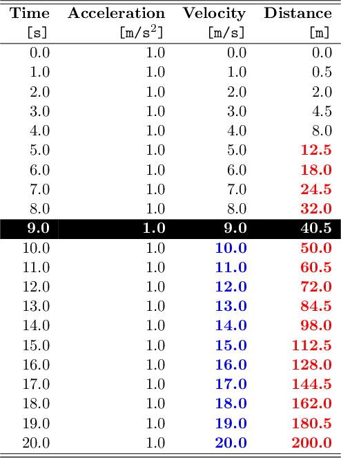
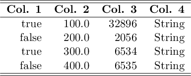
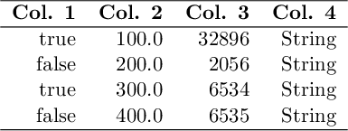
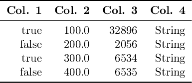

LaTeX back-end
==============

```@meta
CurrentModule = PrettyTables
DocTestSetup = quote
    using PrettyTables
end
```

The following options are available when the LaTeX backend is used. Those can be
passed as keywords when calling the function [`pretty_table`](@ref):

- `body_hlines::Vector{Int}`: A vector of `Int` indicating row numbers in which
    an additional horizontal line should be drawn after the row. Notice that
    numbers lower than 1 and equal or higher than the number of printed rows
    will be neglected. This vector will be appended to the one in `hlines`, but
    the indices here are related to the printed rows of the body. Thus, if `1`
    is added to `body_hlines`, then a horizontal line will be drawn after the
    first data row. (**Default** = `Int[]`)
- `highlighters::Union{LatexHighlighter, Tuple}`: An instance of
    `LatexHighlighter` or a tuple with a list of LaTeX highlighters (see the
    section [LaTeX highlighters](@ref)).
- `hlines::Union{Nothing, Symbol, AbstractVector}`: This variable controls where
    the horizontal lines will be drawn. It can be `nothing`, `:all`, `:none` or
    a vector of integers. (**Default** = `nothing`)
    - If it is `nothing`, which is the default, then the configuration will be
        obtained from the table format in the variable `tf` (see
        [`LatexTableFormat`](@ref)).
    - If it is `:all`, then all horizontal lines will be drawn.
    - If it is `:none`, then no horizontal line will be drawn.
    - If it is a vector of integers, then the horizontal lines will be drawn
        only after the rows in the vector. Notice that the top line will be
        drawn if `0` is in `hlines`, and the header and subheaders are
        considered as only 1 row. Furthermore, it is important to mention that
        the row number in this variable is related to the **printed rows**.
        Thus, it is affected by filters, and by the option to suppress the
        header `noheader`. Finally, for convenience, the top and bottom lines
        can be drawn by adding the symbols `:begin` and `:end` to this vector,
        respectively, and the line after the header can be drawn by adding the
        symbol `:header`.

!!! info
    The values of `body_hlines` will be appended to this vector. Thus,
    horizontal lines can be drawn even if `hlines` is `:none`.

- `label::AbstractString`: The label of the table. If empty, then no label will
    be added. (**Default** = "")
- `longtable_footer::Union{Nothing, AbstractString}`: The string that will be
    drawn in the footer of the tables before a page break. This only works if
    `table_type` is `:longtable`. If it is `nothing`, then no footer will be
    used. (**Default** = `nothing`)
- `noheader::Bool`: If `true`, then the header will not be printed. Notice that
    all keywords and parameters related to the header and sub-headers will be
    ignored. (**Default** = `false`)
- `nosubheader::Bool`: If `true`, then the sub-header will not be printed,
    *i.e.* the header will contain only one line. Notice that this option has no
    effect if `noheader = true`. (**Default** = `false`)
- `row_number_alignment::Symbol`: Select the alignment of the row number column
    (see the section [Alignment](@ref)). (**Default** = `:r`)
- `table_type::Union{Nothing, Symbol}`: Select which LaTeX environment will be
    used to print the table. Currently supported options are `:tabular` for
    `tabular` or `:longtable` for `longtable`. If it is `nothing` then the
    default option of the table format will be used. (**Default** = `nothing`)
- `tf::LatexTableFormat`: An instance of the structure
    [`LatexTableFormat`](@ref) that defines the general format of the LaTeX table.
- `vlines::Union{Nothing, Symbol, AbstractVector}`: This variable controls where
    the vertical lines will be drawn. It can be `:all`, `:none` or a vector of
    integers. In the first case (the default behavior), all vertical lines will
    be drawn. In the second case, no vertical line will be drawn. In the third
    case, the vertical lines will be drawn only after the columns in the vector.
    Notice that the left border will be drawn if `0` is in `vlines`.
    Furthermore, it is important to mention that the column number in this
    variable is related to the **printed columns**. Thus, it is affected by
    filters, and by the columns added using the variable `show_row_number`.
    Finally, for convenience, the left and right border can be drawn by adding
    the symbols `:begin` and `:end` to this vector, respectively.
    (**Default** = `:none`)
- `wrap_table::Union{Nothing, String}`: This variable controls whether to wrap
    the table in a environment defined by the variable `wrap_table_environment`.
    Defaults to `true`. When `false`, the printed table begins with
    `\\begin{tabular}`. This option does not work with `:longtable`. If it is
    `nothing` then the default option of the table format will be used.
    (**Default** = `nothing`)
- `wrap_table_environment::Union{Nothing, String}`: Environment that will be
    used to wrap the table if the option `wrap_table` is `true`. If it is
    `nothing` then the default option of the table format will be used.
    (**Default** = `nothing`)

## LaTeX highlighters

A set of highlighters can be passed as a `Tuple` to the `highlighters` keyword.
Each highlighter is an instance of the structure [`LatexHighlighter`](@ref). It
contains the following two fields:

- `f::Function`: Function with the signature `f(data, i, j)` in which should
    return `true` if the element `(i, j)` in `data` must be highlighted, or
    `false` otherwise.
- `fd::Functions`: A function with the signature `f(data, i, j, str)::String` in
    which `data` is the matrix, `(i, j)` is the element position in the table,
    and `str` is the data converted to string. This function must return a
    string that will be placed in the cell.

The function `f` has the following signature:

    f(data, i, j)

in which `data` is a reference to the data that is being printed, `i` and `j`
are the element coordinates that are being tested. If this function returns
`true`, then the highlight style will be applied to the `(i, j)` element.
Otherwise, the default style will be used.

Notice that if multiple highlighters are valid for the element `(i, j)`, then
the applied style will be equal to the first match considering the order in the
Tuple `highlighters`.

If the function `f` returns true, then the function `fd(data, i, j, str)` will
be called and must return the LaTeX string that will be placed in the cell.

If only a single highlighter is wanted, then it can be passed directly to the
keyword `highlighter` without being inside a `Tuple`.

There are two helpers that can be used to create LaTeX highlighters:

```julia
LatexHighlighter(f::Function, envs::Union{String,Vector{String}})
LatexHighlighter(f::Function, fd::Function)
```

The first will apply recursively all the LaTeX environments in `envs` to the
highlighted text whereas the second let the user select the desired decoration
by specifying the function `fd`.

Thus, for example:

    LatexHighlighter((data,i,j)->true, ["textbf", "small"])

will wrap all the cells in the table in the following environment:

    \textbf{\small{<Cell text>}}

!!! info
    If only a single highlighter is wanted, then it can be passed directly to
    the keyword `highlighter` without being inside a `Tuple`.

!!! note
    If multiple highlighters are valid for the element `(i, j)`, then the
    applied style will be equal to the first match considering the order in the
    tuple `highlighters`.

!!! note
    If the highlighters are used together with [Formatters](@ref), then the
    change in the format **will not** affect the parameter `data` passed to the
    highlighter function `f`. It will always receive the original, unformatted
    value.

```julia-repl
julia> t = 0:1:20;

julia> data = hcat(t, ones(length(t)) * 1, 1 * t, 0.5 .* t.^2);

julia> header = (["Time", "Acceleration", "Velocity", "Distance"],
                 [ "[s]",  "[m/s\$^2\$]",    "[m/s]",      "[m]"]);

julia> hl_v = LatexHighlighter((data, i, j) -> (j == 3) && data[i, 3] > 9, ["color{blue}","textbf"]);

julia> hl_p = LatexHighlighter((data, i, j) -> (j == 4) && data[i, 4] > 10, ["color{red}", "textbf"])

julia> hl_e = LatexHighlighter((data, i, j) -> (i == 10), ["cellcolor{black}", "color{white}", "textbf"])

julia> pretty_table(data, backend = Val(:latex), header = header, highlighters = (hl_e, hl_p, hl_v))
```



!!! note
    The following LaTeX packages are required to render this example:
    `colortbl` and `xcolor`.

## LaTeX table formats

The following table formats are available when using the LaTeX back-end:

`tf_latex_default` (**Default**)



`tf_latex_simple`



`tf_latex_modern`


!!! note
    You need the LaTeX package `array` to use the vertical divisions with this
    format.

`tf_latex_booktabs`



!!! note
    You need the LaTeX package `booktabs` to render this format.
