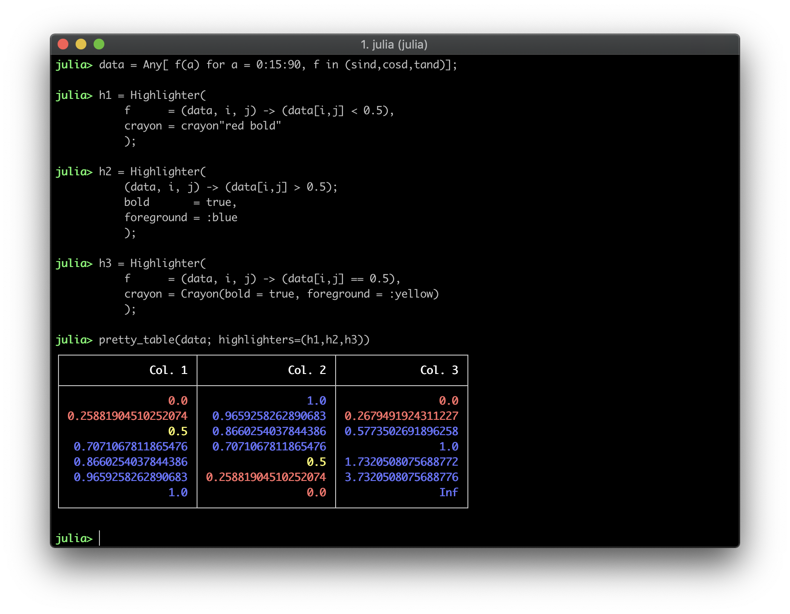
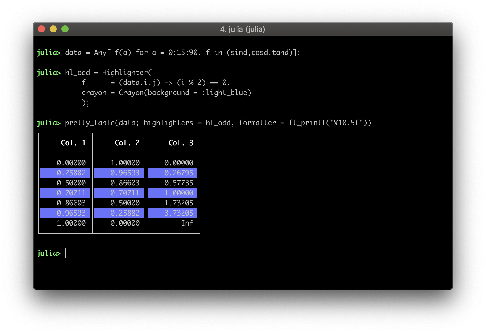

Text back-end
=============

```@meta
CurrentModule = PrettyTables
DocTestSetup = quote
    using PrettyTables
end
```

The following options are available when the text backend is used. Those can be
passed as keywords when calling the function `pretty_table`:

* `border_crayon`: Crayon to print the border.
* `header_crayon`: Crayon to print the header.
* `subheaders_crayon`: Crayon to print sub-headers.
* `rownum_header_crayon`: Crayon for the header of the column with the row
                          numbers.
* `text_crayon`: Crayon to print default text.
* `alignment`: Select the alignment of the columns (see the section
               [Alignment](@ref)).
* `autowrap`: If `true`, then the text will be wrapped on spaces to fit the
              column. Notice that this function requires `linebreaks = true` and
              the column must have a fixed size (see `columns_width`).
* `body_hlines`: A vector of `Int` indicating row numbers in which an additional
                 horizontal line should be drawn after the row. Notice that
                 numbers lower than 1 and equal or higher than the number of
                 printed rows will be neglected. This vector will be appended to
                 the one in `hlines`, but the indices here are related to the
                 printed rows of the body. Thus, if `1` is added to
                 `body_hlines`, then a horizontal line will be drawn after the
                 first data row. (**Default** = `Int[]`)
* `body_hlines_format`: A tuple of 4 characters specifying the format of the
                        horizontal lines that will be drawn by `body_hlines`.
                        The characters must be the left intersection, the middle
                        intersection, the right intersection, and the row. If it
                        is `nothing`, then it will use the same format specified
                        in `tf`. (**Default** = `nothing`)
* `cell_alignment`: A dictionary of type `(i,j) => a` that overrides that
                    alignment of the cell `(i,j)` to `a` regardless of the
                    columns alignment selected. `a` must be a symbol like
                    specified in the section [Alignment](@ref).
* `columns_width`: A set of integers specifying the width of each column. If the
                   width is equal or lower than 0, then it will be automatically
                   computed to fit the large cell in the column. If it is
                   a single integer, then this number will be used as the size
                   of all columns. (**Default** = 0)
* `continuation_row_alignment`: A symbol that defines the alignment of the cells
                                in the continuation row. This row is printed if
                                the table is vertically cropped.
                                (**Default** = `:c`)
* `crop`: Select the printing behavior when the data is bigger than the
          available screen size (see `screen_size`). It can be `:both` to crop
          on vertical and horizontal direction, `:horizontal` to crop only on
          horizontal direction, `:vertical` to crop only on vertical direction,
          or `:none` to do not crop the data at all.
* `crop_num_lines_at_beginning`: Number of lines to be left at the beginning of
                                 the printing when vertically cropping the
                                 output. Notice that the lines required to show
                                 the title are automatically computed.
                                 (**Default** = 0)
* `crop_subheader`: If `true`, then the sub-header size will not be taken into
                    account when computing the column size. Hence, the print
                    algorithm can crop it to save space. This has no effect if
                    the user selects a fixed column width.
                    (**Default** = `false`)
* `ellipsis_line_skip`: An integer defining how many lines will be skipped from
                        showing the ellipsis that indicates the text was
                        cropped. (**Default** = 0)
* `equal_columns_width`: If `true`, then all the columns will have the same
                         width. (**Default** = `false`)
* `filters_row`: Filters for the rows (see the section [Filters](@ref)).
* `filters_col`: Filters for the columns (see the section [Filters](@ref)).
* `highlighters`: An instance of `Highlighter` or a tuple with a list of
                  highlighters (see the section [Text highlighters](@ref)).
* `hlines`: This variable controls where the horizontal lines will be drawn. It
            can be `nothing`, `:all`, `:none` or a vector of integers.
    - If it is `nothing`, which is the default, then the configuration will be
      obtained from the table format in the variable `tf` (see `TextFormat`).
    - If it is `:all`, then all horizontal lines will be drawn.
    - If it is `:none`, then no horizontal line will be drawn.
    - If it is a vector of integers, then the horizontal lines will be drawn
      only after the rows in the vector. Notice that the top line will be drawn
      if `0` is in `hlines`, and the header and subheaders are considered as
      only 1 row. Furthermore, it is important to mention that the row number in
      this variable is related to the **printed rows**. Thus, it is affected by
      filters, and by the option to suppress the header `noheader`. Finally, for
      convenience, the top and bottom lines can be drawn by adding the symbols
      `:begin` and `:end` to this vector, respectively, and the line after the
      header can be drawn by adding the symbol `:header`.
  !!! info

      The values of `body_hlines` will be appended to this vector. Thus,
      horizontal lines can be drawn even if `hlines` is `:none`.

  (**Default** = `nothing`)
* `linebreaks`: If `true`, then `\n` will break the line inside the cells.
                (**Default** = `false`)
* `maximum_columns_width`: A set of integers specifying the maximum width of
                           each column. If the width is equal or lower than 0,
                           then it will be ignored. If it is a single integer,
                           then this number will be used as the maximum width
                           of all columns. Notice that the parameter
                           `columns_width` has precedence over this one.
                           (**Default** = 0)
* `minimum_columns_width`: A set of integers specifying the minimum width of
                           each column. If the width is equal or lower than 0,
                           then it will be ignored. If it is a single integer,
                           then this number will be used as the minimum width
                           of all columns. Notice that the parameter
                           `columns_width` has precedence over this one.
                           (**Default** = 0)
* `newline_at_end`: If `false`, then the table will not end with a newline
                    character. (**Default** = `true`)
* `noheader`: If `true`, then the header will not be printed. Notice that all
              keywords and parameters related to the header and sub-headers will
              be ignored. (**Default** = `false`)
* `nosubheader`: If `true`, then the sub-header will not be printed, *i.e.* the
                 header will contain only one line. Notice that this option has
                 no effect if `noheader = true`. (**Default** = `false`)
* `omitted_cell_summary_crayon`: Crayon used to print the omitted cell summary.
* `overwrite`: If `true`, then the same number of lines in the printed table
               will be deleted from the output `io`. This can be used to update
               the table in the screen continuously. (**Default** = `false`)
* `row_number_alignment`: Select the alignment of the row number column (see the
                          section [Alignment](@ref)). (**Default** = `:r`)
* `screen_size`: A tuple of two integers that defines the screen size (num. of
                 rows, num. of columns) that is available to print the table. It
                 is used to crop the data depending on the value of the keyword
                 `crop`. If it is `nothing`, then the size will be obtained
                 automatically. Notice that if a dimension is not positive, then
                 it will be treated as unlimited. (**Default** = `nothing`)
* `show_omitted_cell_summary`: If `true`, then a summary will be printed after
                               the table with the number of columns and rows
                               that were omitted. (**Default** = `true`)
* `title_autowrap`: If `true`, then the title text will be wrapped considering
                    the title size. Otherwise, lines larger than the title size
                    will be cropped. (**Default** = `false`)
* `title_crayon`: Crayon to print the title.
* `title_same_width_as_table`: If `true`, then the title width will match that
                               of the table. Otherwise, the title size will be
                               equal to the screen width.
                               (**Default** = `false`)
* `tf`: Table format used to print the table (see the section
        [Text table formats](@ref)). (**Default** = `unicode`)
* `vcrop_mode`: This variable defines the vertical crop behavior. If it is
                `:bottom`, then the data, if required, will be cropped in the
                bottom. On the other hand, if it is `:middle`, then the data
                will be cropped in the middle if necessary.
                (**Default** = `:bottom`)
* `vlines`: This variable controls where the vertical lines will be drawn. It
            can be `nothing`, `:all`, `:none` or a vector of integers.
    - If it is `nothing`, which is the default, then the configuration will be
      obtained from the table format in the variable `tf` (see `TextFormat`).
    - If it is `:all`, then all vertical lines will be drawn.
    - If it is `:none`, then no vertical line will be drawn.
    - If it is a vector of integers, then the vertical lines will be drawn only
      after the columns in the vector. Notice that the top line will be drawn if
      `0` is in `vlines`. Furthermore, it is important to mention that the
      column number in this variable is related to the **printed column**. Thus,
      it is affected by filters, and by the options `row_names` and
      `show_row_number`. Finally, for convenience, the left and right vertical
      lines can be drawn by adding the symbols `:begin` and `:end` to this
      vector, respectively, and the line after the header can be drawn by adding
      the symbol `:header`.

  (**Default** = `nothing`)

The keywords `header_crayon` and `subheaders_crayon` can be a `Crayon` or a
`Vector{Crayon}`. In the first case, the `Crayon` will be applied to all the
elements. In the second, each element can have its own crayon, but the length of
the vector must be equal to the number of columns in the data.

!!! note

    If the renderer `show` is used, then all strings will be printed with
    surrounding quotes. However, if a formatter modifies a value and return a
    string, then those surrounding quotes will be removed if the original value
    is not a string.

## Crayons

A `Crayon` is an object that handles a style for text printed on terminals. It
is defined in the package
[Crayons.jl](https://github.com/KristofferC/Crayons.jl). There are many options
available to customize the style, such as foreground color, background color,
bold text, etc.

A `Crayon` can be created in two different ways:

```julia-repl
julia> Crayon(foreground = :blue, background = :black, bold = :true)

julia> crayon"blue bg:black bold"
```

For more information, see the [Crayon.jl
documentation](https://github.com/KristofferC/Crayons.jl/blob/master/README.md).

!!! info

    The Crayon.jl package is re-exported by PrettyTables.jl. Hence, you do not
    need `using Crayons` to create a `Crayon`.

## Cropping

By default, the data will be cropped to fit the screen. This behavior can be
changed by using the keyword `crop`.

```jldoctest
julia> data = Any[1    false      1.0     0x01 ;
                  2     true      2.0     0x02 ;
                  3    false      3.0     0x03 ;
                  4     true      4.0     0x04 ;
                  5    false      5.0     0x05 ;
                  6     true      6.0     0x06 ;];

julia> pretty_table(data, screen_size = (11,30))
┌────────┬────────┬────────┬──
│ Col. 1 │ Col. 2 │ Col. 3 │ ⋯
├────────┼────────┼────────┼──
│      1 │  false │    1.0 │ ⋯
│      2 │   true │    2.0 │ ⋯
│      3 │  false │    3.0 │ ⋯
│   ⋮    │   ⋮    │   ⋮    │ ⋱
└────────┴────────┴────────┴──
   1 column and 3 rows omitted

julia> pretty_table(data, screen_size = (11,30), crop = :none)
┌────────┬────────┬────────┬────────┐
│ Col. 1 │ Col. 2 │ Col. 3 │ Col. 4 │
├────────┼────────┼────────┼────────┤
│      1 │  false │    1.0 │      1 │
│      2 │   true │    2.0 │      2 │
│      3 │  false │    3.0 │      3 │
│      4 │   true │    4.0 │      4 │
│      5 │  false │    5.0 │      5 │
│      6 │   true │    6.0 │      6 │
└────────┴────────┴────────┴────────┘
```

If the keyword `screen_size` is not specified (or is `nothing`), then the screen
size will be obtained automatically. For files, `screen_size = (-1,-1)`, meaning
that no limit exits in both vertical and horizontal direction.

!!! note

    In vertical cropping, the header and the first table row is **always**
    printed.

!!! note

    The highlighters will work even in partially printed data.

If the user selects a fixed size for the columns (using the keyword
`columns_width`), enables line breaks (using the keyword `linebreaks`), and sets
`autowrap = true`, then the algorithm wraps the text on spaces to automatically
fit the space.

```jldoctest
julia> data = ["One very very very big long long line"; "Another very very very big big long long line"];

julia> pretty_table(data, columns_width = 10, autowrap = true, linebreaks = true, show_row_number = true)
┌─────┬────────────┐
│ Row │     Col. 1 │
├─────┼────────────┤
│   1 │   One very │
│     │  very very │
│     │   big long │
│     │  long line │
│   2 │    Another │
│     │  very very │
│     │   very big │
│     │   big long │
│     │  long line │
└─────┴────────────┘
```

It is also possible to change the vertical cropping behavior to crop the table
in the middle instead of the bottom. This can be accomplished by passing the
option `vcrop_mode = :middle` to `pretty_table`:

```jldoctest
julia> data = Any[1    false      1.0     0x01 ;
                  2     true      2.0     0x02 ;
                  3    false      3.0     0x03 ;
                  4     true      4.0     0x04 ;
                  5    false      5.0     0x05 ;
                  6     true      6.0     0x06 ;];

julia> pretty_table(data, screen_size = (11,30), vcrop_mode = :middle)
┌────────┬────────┬────────┬──
│ Col. 1 │ Col. 2 │ Col. 3 │ ⋯
├────────┼────────┼────────┼──
│      1 │  false │    1.0 │ ⋯
│      2 │   true │    2.0 │ ⋯
│   ⋮    │   ⋮    │   ⋮    │ ⋱
│      6 │   true │    6.0 │ ⋯
└────────┴────────┴────────┴──
   1 column and 3 rows omitted
```

## Text highlighters

A set of highlighters can be passed as a `Tuple` to the `highlighters` keyword.
Each highlighter is an instance of the structure `Highlighter` that contains
three fields:

* `f`: Function with the signature `f(data,i,j)` in which should return `true`
       if the element `(i,j)` in `data` must be highlighter, or `false`
       otherwise.
* `fd`: Function with the signature `f(h,data,i,j)` in which `h` is the
        highlighter. This function must return the `Crayon` to be applied to the
        cell that must be highlighted.
* `crayon`: The `Crayon` to be applied to the highlighted cell if the default
            `fd` is used.

The function `f` has the following signature:

    f(data, i, j)

in which `data` is a reference to the data that is being printed, and `i` and
`j` are the element coordinates that are being tested. If this function returns
`true`, then the cell `(i,j)` will be highlighted.

If the function `f` returns true, then the function `fd(h,data,i,j)` will be
called and must return a `Crayon` that will be applied to the cell.

A highlighter can be constructed using three helpers:

```julia
Highlighter(f::Function; kwargs...)
```

where it will construct a `Crayon` using the keywords in `kwargs` and apply it
to the highlighted cell,

```julia
Highlighter(f::Function, crayon::Crayon)
```

where it will apply the `crayon` to the highlighted cell, and

```julia
Highlighter(f::Function, fd::Function)
```

where it will apply the `Crayon` returned by the function `fd` to the
highlighted cell.

!!! info

    If only a single highlighter is wanted, then it can be passed directly to
    the keyword `highlighter` without being inside a `Tuple`.

!!! note

    If multiple highlighters are valid for the element `(i,j)`, then the applied
    style will be equal to the first match considering the order in the tuple
    `highlighters`.

!!! note

    If the highlighters are used together with [Formatters](@ref), then the
    change in the format **will not** affect the parameter `data` passed to the
    highlighter function `f`. It will always receive the original, unformatted
    value.

```julia-repl
julia> data = Any[ f(a) for a = 0:15:90, f in (sind,cosd,tand) ]

julia> h1 = Highlighter( f      = (data,i,j) -> (data[i,j] < 0.5),
                         crayon = crayon"red bold" )

julia> h2 = Highlighter( (data,i,j) -> (data[i,j] > 0.5),
                         bold       = true,
                         foreground = :blue )

julia> h3 = Highlighter( f      = (data,i,j) -> (data[i,j] == 0.5),
                         crayon = Crayon(bold = true, foreground = :yellow) )

julia> pretty_table(data, highlighters = (h1, h2, h3), compact_printing = false)
```



```julia-repl
julia> data = Any[ f(a) for a = 0:15:90, f in (sind,cosd,tand) ]

julia> hl_odd = Highlighter( f      = (data,i,j) -> i % 2 == 0,
                             crayon = Crayon(background = :light_blue))

julia> pretty_table(data, highlighters = hl_odd, formatters = ft_printf("%10.5f"))
```



There are a set of pre-defined highlighters (with names `hl_*`) to make the
usage simpler. They are defined in the file
`./src/backends/text/predefined_highlighters.jl`.

## Text table formats

The following table formats are available when using the text back-end:

`unicode` (**Default**)

```
┌────────┬────────┬────────┬────────┐
│ Col. 1 │ Col. 2 │ Col. 3 │ Col. 4 │
├────────┼────────┼────────┼────────┤
│      1 │  false │    1.0 │      1 │
│      2 │   true │    2.0 │      2 │
│      3 │  false │    3.0 │      3 │
└────────┴────────┴────────┴────────┘
```

`ascii_dots`

```
.....................................
: Col. 1 : Col. 2 : Col. 3 : Col. 4 :
:........:........:........:........:
:      1 :  false :    1.0 :      1 :
:      2 :   true :    2.0 :      2 :
:      3 :  false :    3.0 :      3 :
:........:........:........:........:
```

`ascii_rounded`

```
.--------.--------.--------.--------.
| Col. 1 | Col. 2 | Col. 3 | Col. 4 |
:--------+--------+--------+--------:
|      1 |  false |    1.0 |      1 |
|      2 |   true |    2.0 |      2 |
|      3 |  false |    3.0 |      3 |
'--------'--------'--------'--------'
```

`borderless`

```
  Col. 1   Col. 2   Col. 3   Col. 4

       1    false      1.0        1
       2     true      2.0        2
       3    false      3.0        3
```

`compact`

```
 -------- -------- -------- --------
  Col. 1   Col. 2   Col. 3   Col. 4
 -------- -------- -------- --------
       1    false      1.0        1
       2     true      2.0        2
       3    false      3.0        3
 -------- -------- -------- --------
```

`dataframe`

```
│ Col. 1 │ Col. 2 │ Col. 3 │ Col. 4 │
├────────┼────────┼────────┼────────┤
│      1 │  false │    1.0 │      1 │
│      2 │   true │    2.0 │      2 │
│      3 │  false │    3.0 │      3 │
```

`markdown`

```
| Col. 1 | Col. 2 | Col. 3 | Col. 4 |
|--------|--------|--------|--------|
|      1 |  false |    1.0 |      1 |
|      2 |   true |    2.0 |      2 |
|      3 |  false |    3.0 |      3 |
```

`matrix`

```
┌                     ┐
│ 1   false   1.0   1 │
│ 2    true   2.0   2 │
│ 3   false   3.0   3 │
└                     ┘
```

!!! info

    In this case, the table format `matrix` was printed with the option
    `noheader = true`.

`mysql`

```
+--------+--------+--------+--------+
| Col. 1 | Col. 2 | Col. 3 | Col. 4 |
+--------+--------+--------+--------+
|      1 |  false |    1.0 |      1 |
|      2 |   true |    2.0 |      2 |
|      3 |  false |    3.0 |      3 |
+--------+--------+--------+--------+
```

`simple`

```
========= ======== ======== =========
  Col. 1   Col. 2   Col. 3   Col. 4
========= ======== ======== =========
       1    false      1.0        1
       2     true      2.0        2
       3    false      3.0        3
========= ======== ======== =========
```

`unicode_rounded`

```
╭────────┬────────┬────────┬────────╮
│ Col. 1 │ Col. 2 │ Col. 3 │ Col. 4 │
├────────┼────────┼────────┼────────┤
│      1 │  false │    1.0 │      1 │
│      2 │   true │    2.0 │      2 │
│      3 │  false │    3.0 │      3 │
╰────────┴────────┴────────┴────────╯
```

!!! note

    The format `unicode_rounded` should look awful on your browser, but it
    should be printed fine on your terminal.

```jldoctest
julia> data = Any[ f(a) for a = 0:15:90, f in (sind,cosd,tand)];

julia> pretty_table(data, tf = ascii_dots)
..................................
:   Col. 1 :   Col. 2 :   Col. 3 :
:..........:..........:..........:
:      0.0 :      1.0 :      0.0 :
: 0.258819 : 0.965926 : 0.267949 :
:      0.5 : 0.866025 :  0.57735 :
: 0.707107 : 0.707107 :      1.0 :
: 0.866025 :      0.5 :  1.73205 :
: 0.965926 : 0.258819 :  3.73205 :
:      1.0 :      0.0 :      Inf :
:..........:..........:..........:

julia> pretty_table(data, tf = compact)
 ---------- ---------- ----------
    Col. 1     Col. 2     Col. 3
 ---------- ---------- ----------
       0.0        1.0        0.0
  0.258819   0.965926   0.267949
       0.5   0.866025    0.57735
  0.707107   0.707107        1.0
  0.866025        0.5    1.73205
  0.965926   0.258819    3.73205
       1.0        0.0        Inf
 ---------- ---------- ----------
```

It is also possible to define you own custom table by creating a new instance of
the structure [`TextFormat`](@ref). For example, let's say that you want a table
like `simple` that does not print the bottom line:

```jldoctest
julia> data = Any[ f(a) for a = 0:15:90, f in (sind,cosd,tand)];

julia> tf = TextFormat(up_right_corner     = '=',
                       up_left_corner      = '=',
                       bottom_left_corner  = '=',
                       bottom_right_corner = '=',
                       up_intersection     = ' ',
                       left_intersection   = '=',
                       right_intersection  = '=',
                       middle_intersection = ' ',
                       bottom_intersection  = ' ',
                       column              = ' ',
                       row                 = '=',
                       hlines              = [:begin,:header]);

julia> pretty_table(data, tf = tf)
=========== ========== ===========
    Col. 1     Col. 2     Col. 3
=========== ========== ===========
       0.0        1.0        0.0
  0.258819   0.965926   0.267949
       0.5   0.866025    0.57735
  0.707107   0.707107        1.0
  0.866025        0.5    1.73205
  0.965926   0.258819    3.73205
       1.0        0.0        Inf

```

or that does not print the header line:

```jldoctest
julia> data = Any[ f(a) for a = 0:15:90, f in (sind,cosd,tand)];

julia> tf = TextFormat(up_right_corner     = '=',
                       up_left_corner      = '=',
                       bottom_left_corner  = '=',
                       bottom_right_corner = '=',
                       up_intersection     = ' ',
                       left_intersection   = '=',
                       right_intersection  = '=',
                       middle_intersection = ' ',
                       bottom_intersection  = ' ',
                       column              = ' ',
                       row                 = '=',
                       hlines              = [:begin,:end]);

julia> pretty_table(data, tf = tf)
=========== ========== ===========
    Col. 1     Col. 2     Col. 3
       0.0        1.0        0.0
  0.258819   0.965926   0.267949
       0.5   0.866025    0.57735
  0.707107   0.707107        1.0
  0.866025        0.5    1.73205
  0.965926   0.258819    3.73205
       1.0        0.0        Inf
=========== ========== ===========
```

For more information, see the documentation of the structure
[`TextFormat`](@ref).
