Text back-end examples
======================

```@meta
CurrentModule = PrettyTables
DocTestSetup = quote
    using PrettyTables
end
```

In the following, it is presented how the following matrix can be printed using
the text back-end.

```julia-repl
julia> data = Any[ 1    false      1.0     0x01 ;
                   2     true      2.0     0x02 ;
                   3    false      3.0     0x03 ;
                   4     true      4.0     0x04 ;
                   5    false      5.0     0x05 ;
                   6     true      6.0     0x06 ;]
```

```julia-repl
julia> pretty_table(data)
```

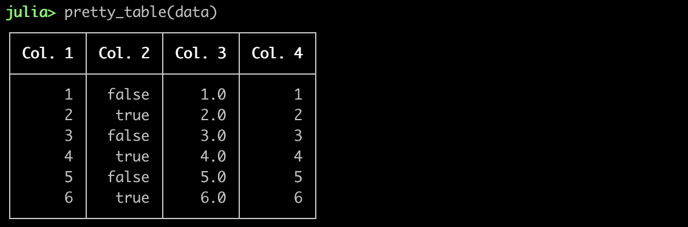

```julia-repl
julia> pretty_table(data, border_crayon = crayon"yellow")
```

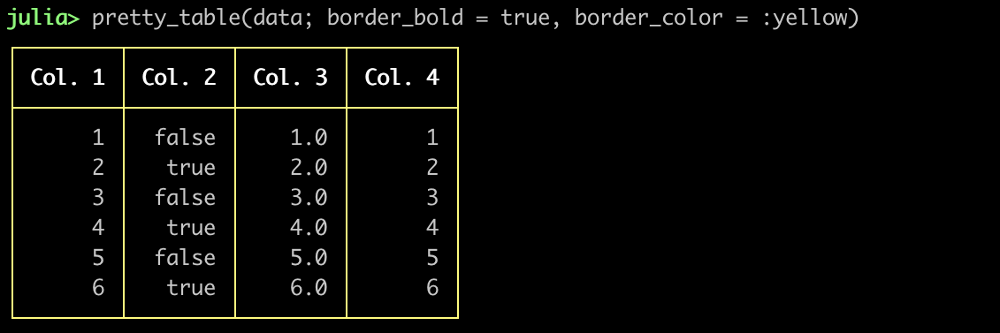

```julia-repl
julia> pretty_table(data, tf = tf_simple, border_crayon = crayon"bold yellow", header_crayon = crayon"bold green")
```

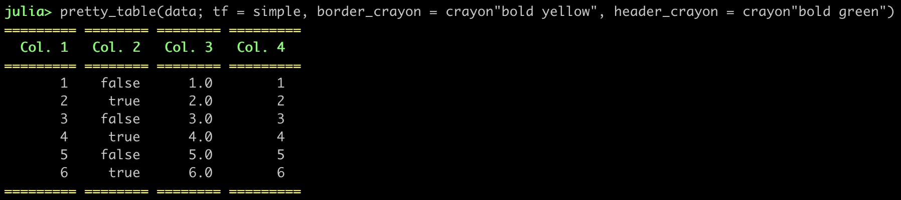

```julia-repl
julia> pretty_table(data, tf = tf_markdown, show_row_number = true)
```

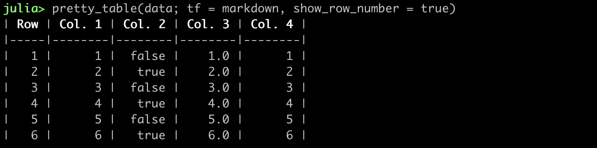

The following example shows how `formatters` can be used to change how elements
are printed.

```julia-repl
julia> formatter = (v, i, j) -> begin
           if j != 2
               return isodd(i) ? i : 0
           else
               return v
           end
       end

julia> pretty_table(data, tf = tf_ascii_rounded, formatters = formatter)
```

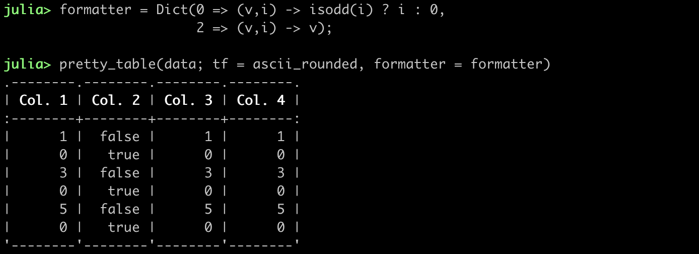

The following example indicates how `highlighters` can be used to highlight the
lowest and highest element in the data considering the columns 1, 3, and 5:

```julia-repl
julia> h1 = Highlighter((data, i, j) -> j in (1, 3, 4) && data[i, j] == maximum(data[2:end, [1, 3, 4]]),
                        bold       = true,
                        foreground = :blue )

julia> h2 = Highlighter( (data,i,j)->j in (1, 3, 4) && data[i, j] == minimum(data[2:end,[1, 3, 4]]),
                         bold       = true,
                         foreground = :red )

julia> pretty_table(data, highlighters = (h1, h2))
```

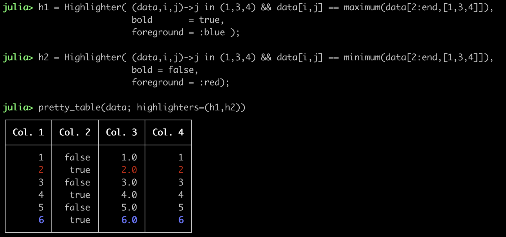

Since this package has support to the API defined by
[Tables.jl](https://github.com/JuliaData/Tables.jl), then many formats, *e.g*
[DataFrames.jl](https://github.com/JuliaData/DataFrames.jl), can be pretty
printed:

```julia-repl
julia> using DataFrames

julia> df = DataFrame(A = 1:2:20, B = rand(10), C = rand(10))

julia> pretty_table(df, formatters = ft_printf("%.3f", [2, 3]), highlighters = (hl_lt(0.2), hl_gt(0.8)))
```

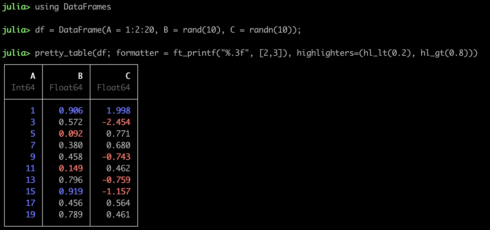

You can use `body_hlines` keyword to divide the table into interesting parts:

```julia-repl
julia> pretty_table(data, body_hlines = [2, 4])
```

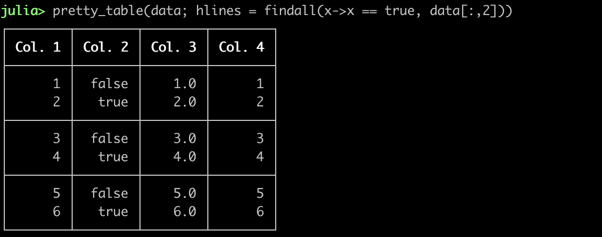

If you want to break lines inside the cells, then you can set the keyword
`linebreaks` to `true`. Hence, the characters `\n` will cause a line break
inside the cell.

```julia-repl
julia> text = ["This line contains\nthe velocity [m/s]" 10.0;
               "This line contains\nthe acceleration [m/s^2]" 1.0;
               "This line contains\nthe time from the\nbeginning of the simulation" 10;]

julia> pretty_table(text, linebreaks = true, body_hlines = [1, 2, 3])
```

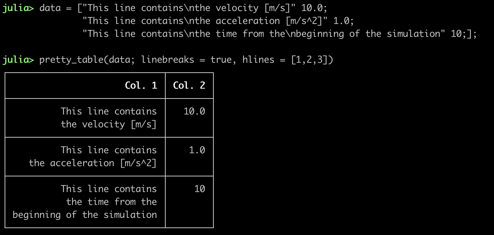

The keyword `noheader` can be used to suppres the header, which leads to a very
simplistic, compact format.

```julia-repl
julia> pretty_table(data, tf = tf_borderless, noheader = true)
```

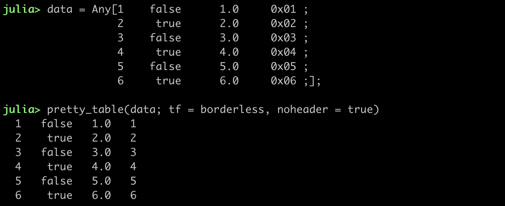

In the following, it is shown how the filters can be used to print only the even
rows and columns:

```julia-repl
julia> A = [(0:1:10)'
            (1:1:11)'
            (2:1:12)'
            (3:1:13)'
            (4:1:14)']

julia> f_c(data, i) = i % 2 == 0

julia> f_r(data, i) = i % 2 == 0

julia> pretty_table(A, filters_row = (f_r,), filters_col = (f_c,), show_row_number = true)
```

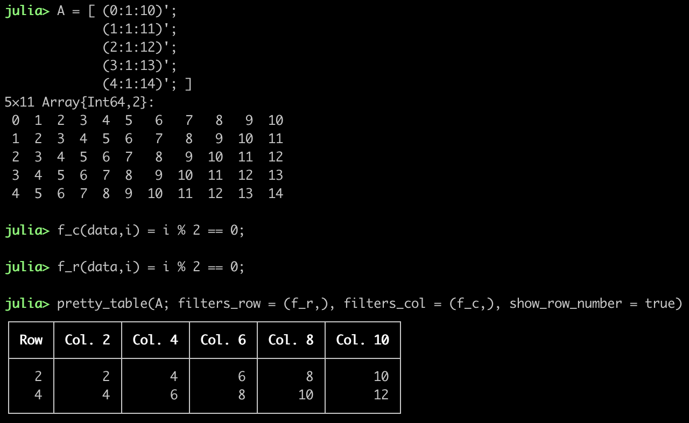

By default, if the data is larger than the display, then it will be cropped to
fit it. This can be changed by using the keywords `crop` and `display_size`.

```julia
julia> data = rand(100, 10); pretty_table(data, highlighters = (hl_gt(0.5),))
```

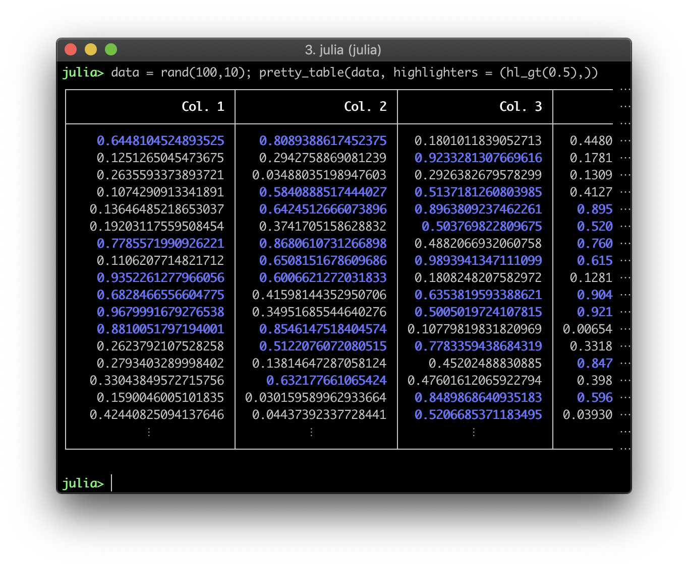

You can use the keyword `columns_width` to select the width of each column, so
that the data is cropped to fit the available space.

```julia-repl
julia> mat = rand(100, 4)

julia> pretty_table(mat,
                    highlighters = hl_gt(0.5),
                    columns_width = [7, -1, 7, 8],
                    compact_printing = false)
```

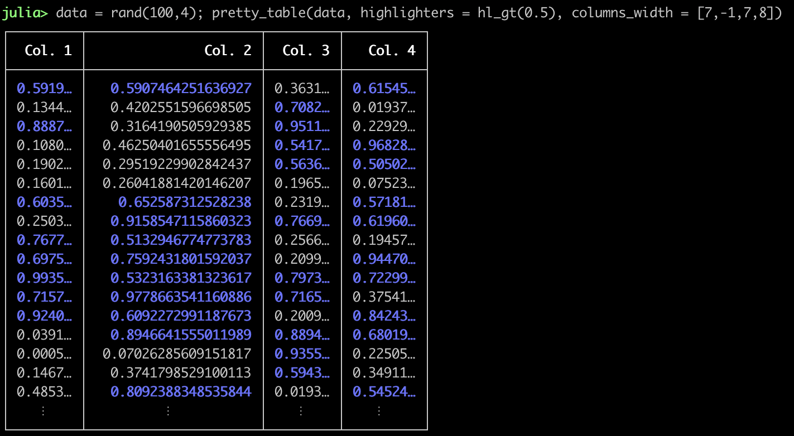

If you want to save the printed table to a file, you can do:

```julia-repl
julia> open("output.txt", "w") do f
            pretty_table(f,data)
       end
```

This package can also be used to create data reports in text format:

```julia-repl
julia> data = ["Torques" "" "" "";
               "Atmospheric drag" "."^10 10 "10⁻⁵ Nm";
               "Gravity gradient" "."^10 3 "10⁻⁵ Nm";
               "Solar radiation pressure" "."^10 0.1 "10⁻⁵ Nm";
               "Total" "."^10 13.1 "10⁻⁵ Nm";
               "" "" "" ""
               "Angular momentum" "" "" "";
               "Atmospheric drag" "."^10 6.5 "Nms";
               "Gravity gradient" "."^10 3.0 "Nms";
               "Solar radiation pressure" "."^10 1.0 "Nms";
               "Total" "."^10 10.5 "Nms"]

julia> pretty_table(data, tf = tf_borderless,
                    noheader = true,
                    cell_alignment = Dict((1, 1) => :l, (7, 1) => :l),
                    formatters = ft_printf("%10.1f", 2),
                    highlighters = (hl_cell([(1, 1); (7, 1)], crayon"bold"),
                                    hl_col(2, crayon"dark_gray"),
                                    hl_row([5, 11], crayon"bold yellow")),
                    body_hlines = [1,7],
                    body_hlines_format = Tuple('─' for _ = 1:4) )
```

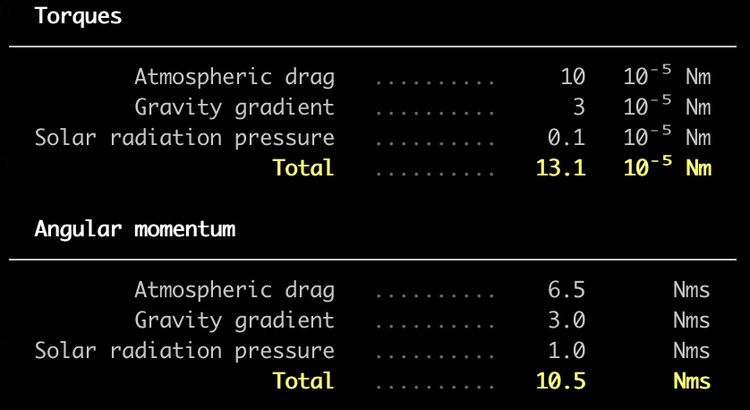

The highlighters API can be used to dynamically highlight cells. In the next
example, it is shown how the package
[ColorSchemes.jl](https://github.com/JuliaGraphics/ColorSchemes.jl) can be
integrated to build a table with a color map (the following example will be
displayed better in a terminal that supports 24-bit color):

```julia-repl
julia> using ColorSchemes

julia> data = [sind(x) * cosd(y) for x in 0:10:180, y in 0:10:180]

julia> hl = Highlighter((data, i, j) -> true,
                        (h, data, i, j) -> begin
                             color = get(colorschemes[:coolwarm], data[i, j], (-1, 1))
                             return Crayon(foreground = (round(Int, color.r * 255),
                                                         round(Int, color.g * 255),
                                                         round(Int, color.b * 255)))
                         end)

julia> pretty_table(data;
                    header = ["x = $(x)°" for x = 0:10:180],
                    row_names = ["y = $(y)°" for y = 0:10:180],
                    highlighters = hl,
                    formatters = ft_printf("%.2f"))
```


